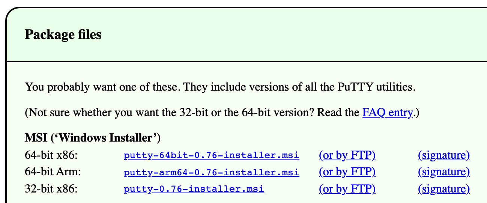

# BIOL*3300 Lab1 F21
# Getting started with UNIX on Compute Canada

## Prerequisites
You should already have a **Compute Canada Graham account**.

### For Macs - Logging in 
1. Open a terminal (under Applications/Utilities on a Mac).
1. Type your graham account into the terminal:
    ```console
    ssh username@graham.computecanada.ca
    ```
    **where 'username' is replaced with your username.** Press return.
1. Type in your password. **Note no characters will display when you are typing.** Press return after your password and all the following commands.


### For Windows - Logging in 
Windows needs a terminal to connect with, we recommend you install [PuTTY](https://www.chiark.greenend.org.uk/~sgtatham/putty/latest.html)
1. Nevigate to package files and choose a version of .msi link based on your operating system.

1. Download PuTTY with default options (left click on next). 
1. Set Putty Host Name field as following: Enter the server name in Host Name, **host name is your Graham account.** 
1. Make sure the Connection type is SSH.

1. Click Open and will ask you for your user name and password. **Note no characters will display when you are typing password.** Press return after your password and all the following commands.


## Introduction to Unix and Command Line
<div style="text-align: justify"> Unix is very likely the most foundational skillset we can develop for bioinformatics (and much more than bioinformatics). Many of the most common and powerful bioinformatics approaches happen in this text-based environment, and having a solid foundation here can make everything we’re trying to learn and do much easier. </div>

### Why Unix?
<div style="text-align: justify"> The Unix operating system has been around since 1969. Back then there was no such thing as a graphical user interface. You typed everything. It may seem archaic to use a keyboard to issue commands today, but it’s much easier to automate keyboard tasks than mouse tasks. Increasingly, the raw output of biological research exists usually in the form of large text files. Unix is particularly suited to working with such files and has several powerful (and flexible) commands that can process your data for you. </div>

### What is the command line?
* Command line interface is a tool into which one can type commands to perform tasks.
* The user interface that accepts the typed responses and displays the data on the screen is called a shell.
* An all-text display (most of the time your mouse doesn’t work).

### Getting started with your shell
After logging into Compute Canada Graham account, system messages are often displayed, followed by the "prompt". A prompt is a short text message at the start of the command line and ends with \$ in bash shell, commands are typed after the prompt. 

For now, we will enter single commands through the terminal. **If you lose the command prompt (such as a greater than sign \>), press control and c at the same time. This is an "interrupt" command that will likely bring the prompt back.** 

### Command line basics
First some basics - how to look at your surroundings. We use **pwd** command (for print working directory), which is to find out what the path is for the directory we are sitting in. 
```console
    pwd
```
We use the **ls** command (for list), we can see what directories and files are in the current directory we are sitting in. **A single dot (.) refers to the current directory**. If you are in *this* directory, you can omit it. 
```console
    ls .
    ls
```
Each command can act as a basic tool, or you can add 'options' or 'flags' that modify the default behavior of the tool. Let’s try one, and see what the man page for the 'list files' command 'ls' is like.
```console
    ls -l
```
how do I know which options do what?
```console
    man ls
```
Use **space** to move down and **q** to quit this manual page.

### The Unix directory structure
Your computer stores file locations in a hierarchical structure. You are likely already used to navigating through this stucture by clicking on various folders (also known as directories) in a Windows Explorer window or a Mac Finder window. Just like we need to select the appropriate files in the appropriate locations there (in a GUI), we need to do the same when working at a command-line interface. What this means in practice is that each file and directory has its own "address", and that address is called its "path". Here is an image of an example file-system structure:

Usually, **/home** is where the user accounts reside, ie. user’s "home" directory. For example, for a user that has a username of "hchang02": their home directory is **/home/hchang02**. It is the directory that a user is located after starting a new shell or logging into Compute Canada Graham server.

### Moving around
The filesystem you’re working on is like the branching root system of a tree. The top level, right at the root of the tree, is called the 'root' directory, specified by **/** which is the divider for directory addresses, or 'paths'. We can also move into the directory containing the file we want to work with by using the **cd** command (change directory).

Go to the root directory, list directories and files, and print working directory:  
```console
    cd /
    ls
    pwd
```
Go back to your home directory, you have three ways: **(Note you should replace username to your username)**
```console
    cd /home/username
    pwd
``` 
The tilde **~** is a short form of a user’s home directory.   
```console
    cd ~
    pwd
```
No effect? that's because by itself it sends you home. 
```console
    cd
    pwd
```
Now if you run **ls** command, you will see a directory called **scratch**. **Note in the following labs, we will run all the commands and store all the files in this directory.** The scratch filesystem on Compute Canada is intended as temporary, fast storage for data being used during job execution. And we will talk more when we introduce Compute Canada officially. 

```console
    ls
    cd scratch
    ls
    pwd
``` 
**You can always check your current directory with pwd.**

### Create and Destroy
Let's create a directory "Biol3300" in your scratch directory with the command **mkdir** (for make directory):
```console
    mkdir Biol3300
    cd Biol3300
    pwd
``` 

Two dots **..** refers to the directory one level up. Directories can be deleted with **rmdir** (for remove directory):
```console
    cd ..
    ls
    rmdir Biol3300
    ls
``` 
Let's create a directory "Lab1" inside the directory "Biol3300" with the option -p. The option -p tells unix to make the directory and if required all parent directories.
```console
    man mkdir
    mkdir -p Biol3300/Lab1
    cd Biol3300/Lab1
    pwd
    cd ../..
``` 
The command line is a little more forgiving when trying to delete a directory. If the directory is not empty, rmdir will give us an error.
```console
    rmdir Biol3300
```
Let's go back to our Biol3300 directory. The echo command simply "echoes" back the contents you provide then we redirect (**>**) them to a file.
```console
    cd Biol3300
    echo 'Hello, world!' > first.txt
```
Command **cat** means 'concatenate'
```console
    cat first.txt first.txt first.txt > second.txt
    cat second.txt
```
Another standard useful program for viewing the contents of a file is less. This opens a searchable, read-only program that allows us to scroll through the document:
```console
    less second.txt
```
To exit the less program, press the **"q"** key.

To create a file, you can also use **touch**, which creates empty files.
```console
    touch newfile.txt
    less newfile.txt    
```
**By convention files start with lower case letters and directories start with upper case.**


### Absolute vs relative path
There are two ways to specify the path (address) of the file we want to do something to:
* An absolute path is an address that starts from an explicitly specified location: either the "root" / or the "home" ~/ location. (Side note, because we also may see or hear the term, the "full path", is the absolute path that starts from the "root" /.)
* A relative path is an address that starts from wherever directory in which we currently are.

Relative path (start here, down through one level up, Biol3300 and Lab1):
```console
    pwd 
    cd ../Biol3300/Lab1/
    pwd
```
Absolute path (start at root, take steps): **(Note you should replace username to your username)**
```console
    pwd
    cd /home/username/scratch/Biol3300/Lab1/
    pwd
```
### Copying, moving, and renaming files
The commands **cp** and **mv** (copy and move) have the same basic structure. They both require two positional arguments: the first is the file we want to act on, and the second is where we want it to go (which can include the name we want to give it).

To see how this works, let’s make a copy of "first.txt" in the Biol3300 directory:
```console
    cd ..
    pwd
    ls
    cp first.txt first_copy.txt
    ls
```
By just giving the second argument a name and nothing else (meaning no path in front of the name), we are implicitly saying we want it copied to where we currently are.

To make a copy and put it somewhere else, like in our subdirectory "**Lab1**", we could change the second positional argument using a relative or absolute path. (Remember a path is "relative" because it starts from where we currently are):
```console
    ls Lab1/
    cp first.txt Lab1/first_copy.txt
    ls Lab1/
```
<div style="text-align: justify"> We also did something different here with both ls. We gave ls a directory name, and ls listed the contents of that directory. In fact, we can provide any path to ls and it will give us the contents of that directory. Although you are peaking into different directories, your position in the file hierarchy has not changed. Similarly, you can copy into any place in the filesystem (assuming you have permission). This ability to quickly access any directory or file while working in a different directory is a major advantage of Unix.</div> 

The **mv** command is used to move files. Let’s move the "newfile.txt" file into the "Lab1" subdirectory:
```console
    mv newfile.txt Lab1/
    ls
    ls Lab1/
```
To copy it to that subdirectory but keep the same name, we could type the whole name out, but we can also just provide the directory but leave off the file name. Note we can also copy file to our current directory with a single dot.
```console
    cp second.txt Lab1/
    ls
    ls Lab1/
    cp Lab1/newfile.txt .
    ls
```
The mv command is also used to rename files. This may seem strange at first, but remember that the path (address) of a file actually includes its name too (otherwise everything in the same directory would have the same path).
```console
    ls
    mv second.txt second_old.txt
    ls
```
To delete files there is the rm command (remove). This requires at least one argument specifying the file we want to delete. **But again, caution is warranted. In UNIX, you delete a file with the command rm filename. The file is not in "Trash". It is deleted forever! There will be no confirmation or retrieval from a waste bin afterwards.**
```console
    ls
    rm second_old.txt
    ls
```
A safe way to use rm is to use the -i option. -i is highly recommended whenever rm is used.The computer prompts you to see if you are sure about the removal.The command "rm -i second.txt" results in: remove second.txt? To remove it, you would type, "y".
```console
    ls
    rm -i second.txt
    ls
```
**Please be very careful using rm and always use -i.**

### BONUS ROUND: Tab-completion is our friend!
<div style="text-align: justify"> Tab-completion is a huge time-saver and helps prevent mistakes. If we are trying to specify a file that’s in our current working directory, we can begin typing its name and then press the tab key to complete it. If there is only one possible way to finish what we’ve started typing, it will complete it entirely for us. If there is more than one possible way to finish what we’ve started typing, it will complete as far as it can, and then hitting tab twice quickly will show all the possible options. If tab-complete does not do either of those things, then we are either confused about where we are, or we’re confused about where the file is that we’re trying to do something to. Using Tab completion is great!</div>


### Reference
These lab materials are from the following tutorials:
1. https://j.p.gogarten.uconn.edu/mcb5472_2018/current.pdf
1. https://ucdavis-bioinformatics-training.github.io/2020-Intro_Single_Cell_RNA_Seq/prerequisites/cli/command-line-intro
1. https://astrobiomike.github.io/unix/getting-started

