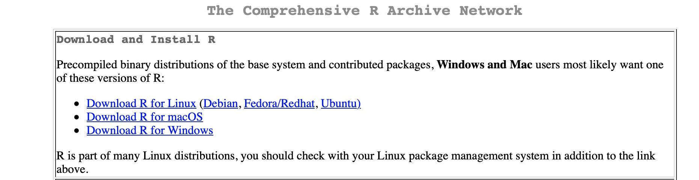
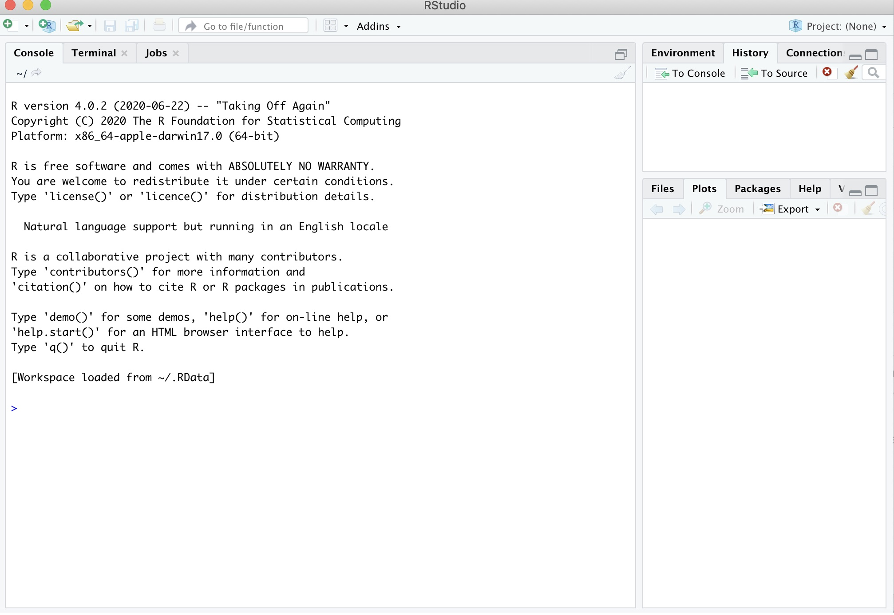
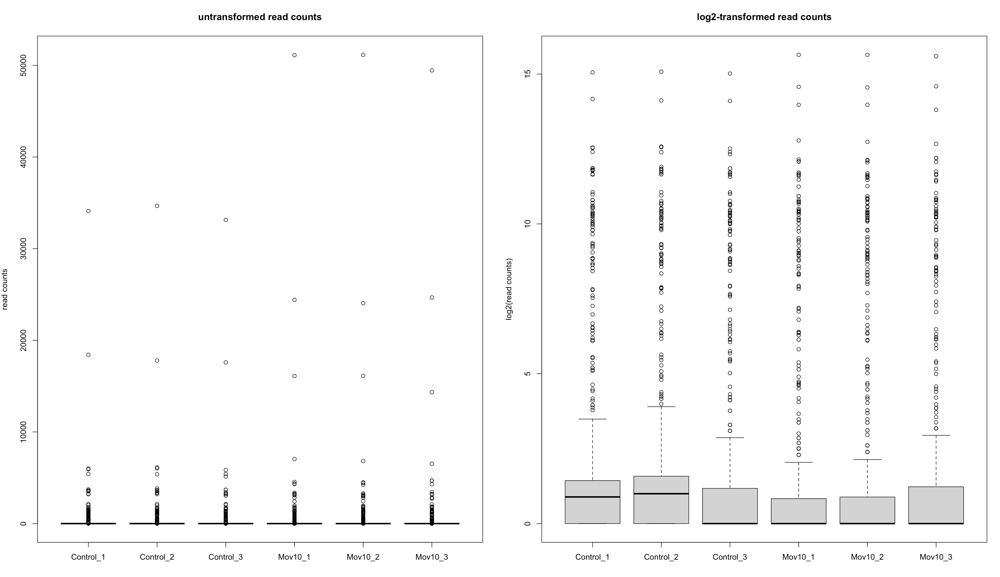
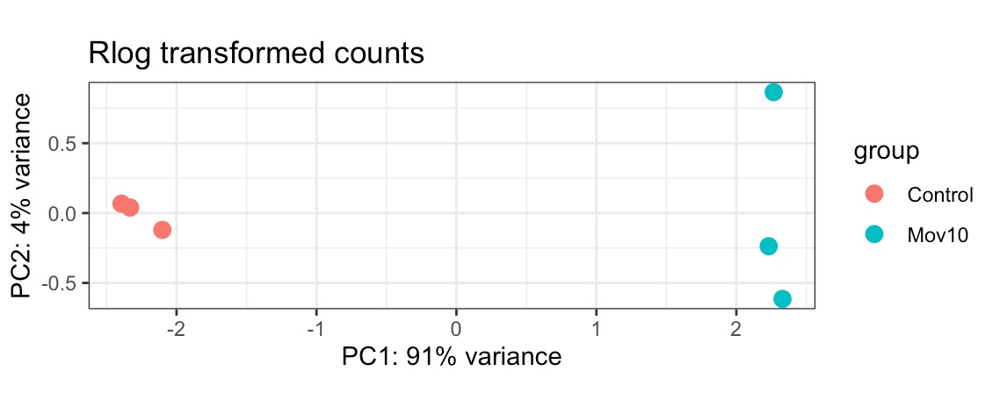
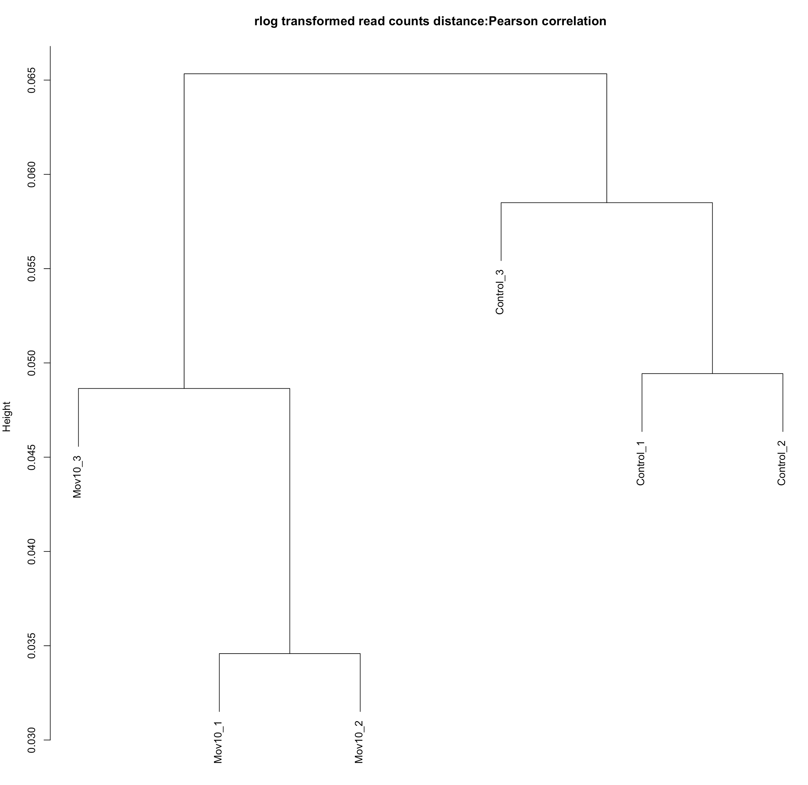

# BIOL*3300 Lab10 F21
## Normalizing and Transforming Read Counts
### Background review
In the last lab, we performed the RNAseq read alignment analysis with a replicate in the Mov10 overexpression group using STAR, a splice-aware alignment tool. After we have our reads aligned to the genome, we also counted how many reads have been mapped to each gene with featureCounts program. Our final output was 2 columns file in which each row represents a gene (or feature) and its corresponding counts.   

In our dataset, we have two groups (control and Mov10oe), and in this lab we want to process read counts and investigate how samples cluster using R software.

### Data Processing in R
R is a software environment for statistical computing and graphics. R is widely used in the field of bioinformatics, amongst various other disciplines. It can be locally installed on almost all operating systems (and it's free!). Numerous packages are available that help in increasing efficency of data handling, data manipulation and data analysis. 

R is a powerful language that can be very useful for NGS data analysis, and there are many popular packages for working with RNA-Seq count data. These packages include edgeR, DESeq2, and limma-voom. 

In this lab, we will process RNA-Seq count data and visualize relationships amongst different RNASeq experiments.

#### RStudio Setup 
We will work in RStudio. You will need to install it on your own computer. RStudio is an open-source project that brings many powerful coding tools together into an  intuitive easy-to-learn interface.  RStudio runs in all major platforms (Windows, Mac, Linux) and through a web browser (using the server installation).

Step1: Install R https://cran.rstudio.com
<center>

</center>

Step2: Install RStudio https://www.rstudio.com/products/rstudio/download/#download
<center>

</center>

Desktop Version:
<center>

</center>

RStudio on initial startup has different available windows. Key ones are the **Console** is where you can type commands and see output. The **History** tab shows a list of commands used so far. The files tab  shows all  The **plots** tab will show  all your graphs. 

When you launch R, you will be greeted with a prompt (>) and a blinking cursor: **>**
* In this tutorial, copy the commands or codes after the **">"** sign in your Console. 
* In your Console, if your commands or codes have no responds, please press "control+ c" at the same time to quit the process.
* Contents after **"#"** are the annotations for R commands. There is no need to copy to the Console, but RStudio won’t report errors if you do. 

#### Getting and processing the count data
We will now use the output file (**RNA_seq_featurecounts.txt** in Courselink lab 10 folder already) based on 2 groups (control and Mov10oe) of 6 samples. The featureCounts file was generated by processing the .bam alignment files from the six samples. 

First, download the file **RNA_seq_featurecounts.txt** from courselink. Create a Lab10 folder on your desktop and move your downloaded file into Lab10 folder. You can take a look at this file using Notepad, TextEdit, or the Unix head command if your system has the ability. Gene name is in the first column. RNASeq read counts for the six samples are in the last size columns.


#### Read the file into R
For MAC users:
```{r}
# get the table of read counts by indicating the path to the file
> readcounts <- read.table("~/Desktop/Lab10/RNA_seq_featurecounts.txt",header=TRUE) 
```
For Windows users:
```{r}
> getwd()  
[1] "C:/Users/KellerLb/Documents"
```
Note here KellerLb should be your **user name** and remember to **substitute KellerLb with your user name** in the following command lines.
```{r}
# get the table of read counts by indicating the path to the file
> readcounts <- read.table("C:/Users/KellerLb/Desktop/Lab10/RNA_seq_featurecounts.txt",header = TRUE)
```
#### Wrangle the data into the desired format
```{r}
# One of the requirements of the assay () slots is that the row.names 
# correspond to the gene IDs and the col.names to the sample names
> row.names(readcounts) <- readcounts$Geneid

# In addition , we need to exclude all columns that do not contain read counts
> readcounts <- readcounts[,-c(1:6)]

# give meaningful sample names - this can be achieved via numerous approaches
# the one shown here is the least generic and most error - prone one!
> names(readcounts) <- c("Control_1","Control_2","Control_3","Mov10_1","Mov10_2","Mov10_3")

# ALWAYS CHECK YOUR DATA AFTER YOU MANIPULATED IT!
> str(readcounts)
> head(readcounts,n = 3) 
        Control_1 Control_2 Control_3 Mov10_1 Mov10_2 Mov10_3
WASH7P          3         1         2       2       0       0
FAM138F         0         0         0       0       0       0
FAM138A         0         0         0       0       0       0

# make a data.frame with meta-data where row.names should match the individual
# sample names
> sample_info <- data.frame(condition = gsub("_[0-9]+"," ",names(readcounts)),
row.names = names(readcounts))
> sample_info
          condition
Control_1  Control 
Control_2  Control 
Control_3  Control 
Mov10_1      Mov10 
Mov10_2      Mov10 
Mov10_3      Mov10 
```
#### Normalizing and Transforming Read Counts
The numbers (or estimates) of reads overlapping with a given gene cannot be directly interpreted as absolute proxies of individual gene expression levels. The value that is obtained for a single gene in a single sample is based on the number of reads corresponding to that gene (or transcript), but there are numerous factors that influence the efficiency of amplification and sequencing of DNA fragments (e.g. GC-bias). Also, in order to compare the gene expression between two RNASeq datasets, we must calculate the fraction of reads assigned to each gene relative to the total number of reads and with respect to the entire RNA repertoire, which may vary drastically from sample to sample. The purpose of normalization is to eliminate systematic effects that are not associated with the biological differences of interest.

We will use DESeq2 to do this normalization. DESeq2 is an R package. DESeq2 has many functions that are useful for RNA Seq analyses. You will need to install DESeq2 locally on your machine. This can take a while. Please let the TA know if you have problems. Note, you need to call the library command every time you run the code. You do not need to install the packages.  

Like most analysis packages, data needs to be imported into a data structure that is specific to the package. This way the program can more simply apply functions to the data. In the code below, we make a DESeq data structure from our "readcounts" data.

We also use a function, counts, that is made available to us through DESeq2. 

```{r}
# IF NEEDED, install DESeq2,which is not available via install.packages(),
# but through bioconductor
> if (!requireNamespace("BiocManager", quietly = TRUE))
    install.packages("BiocManager")
> BiocManager::install("DESeq2")
> library(DESeq2)

# generate the DESeqDataSet
> DESeq.ds <- DESeqDataSetFromMatrix(countData = readcounts,
                            colData = sample_info,
                            design = ~ condition)

# test what counts () returns
> counts(DESeq.ds)
Control_1 Control_2 Control_3 Mov10_1 Mov10_2 Mov10_3
WASH7P                3         1         2       2       0       0
LOC729737             0         0         1       1       1       0
LOC100133331          1         0         0       0       0       1
...
SH3BGRL3              0         0         0       0       1       0
DHDDS                 0         1         0       0       0       1
 [ reached getOption("max.print") -- omitted 773 rows ]

# remove genes without any counts
> DESeq.ds <- DESeq.ds[rowSums(counts(DESeq.ds))>0,]

# investigate different sample sizes
> colSums(counts(DESeq.ds)) 
Control_1 Control_2 Control_3   Mov10_1   Mov10_2   Mov10_3 
   164087    140232    107047    224925    205092    125930 
```
DESeq2’s default method to normalize read counts to account for differences in sequencing depths is implemented in estimateSizeFactors(), and we apply it below.

```{r}
# calculate the size factor and add it to the data set
> DESeq.ds <- estimateSizeFactors(DESeq.ds)
> sizeFactors(DESeq.ds)
Control_1 Control_2 Control_3   Mov10_1   Mov10_2   Mov10_3 
1.1744444 1.0046460 0.7943334 1.2825146 1.1775918 0.7454880

# if you check colData () again , you see that this now contains the sizeFactors
> colData(DESeq.ds)
DataFrame with 6 rows and 2 columns
          condition sizeFactor
           <factor>  <numeric>
Control_1  Control    1.174444
Control_2  Control    1.004646
Control_3  Control    0.794333
Mov10_1    Mov10      1.282515
Mov10_2    Mov10      1.177592
Mov10_3    Mov10      0.745488
# counts () allows you to immediately retrieve the normalized read counts
> counts.sf_normalized <- counts(DESeq.ds, normalized = TRUE)
```

#### Log2 transformation of read counts
Due to the relatively large dynamic range of expression values that RNA-seq data can cover, many downstream analyses (including clustering) work much better if the read counts are transformed to the log scale following normalization. While you will occasionally see log10 transformed read counts, log2 is more commonly used because it is easier to think about doubled values rather than powers of 10. The transformation should be done in addition to sequencing depth normalization.

```{r}
# transform size - factor normalized read counts to log2 scale using a
# pseudocount of 1
> log.norm.counts <- log2(counts.sf_normalized + 1)
```
You can see how the log2 transformation makes even simple graphs more easily interpretable by generating boxplots of read counts.

```{r}
# to plot the following two images next to each other
> par(mfrow=c(1,2))
# first, boxplots of non-transformed read counts (one per sample )
> boxplot(counts.sf_normalized, 
            main = "untransformed read counts", 
            ylab = "read counts")

# box plots of log2-transformed read counts
> boxplot(log.norm.counts,
            main = "log2-transformed read counts",
            ylab = "log2(read counts)")
```
You will see the two boxplots like the following:

<center>

</center>

####  Principal Components Analysis (PCA)
Principal components analysis can be used to investigate if genes’ patterns of expression across different samples share underlying attributes. The information from hundreds of genes in a study may be represented by one or a small number of principle components.

```{r}
# obtain regularized log - transformed values
> DESeq.rlog <- rlog(DESeq.ds,blind = TRUE)

# DESeq2 also offers a convenience function based on ggplot2 to do PCA directly on a DESeqDataSet:
> install.packages("ggplot2")
> library(ggplot2)

# PCA 
> P <- plotPCA(DESeq.rlog)
> P <- P + theme_bw() + ggtitle("Rlog transformed counts")
> print(P)
```

<center>

</center>

#### Hierarchical clustering
Hierarchical clustering can be used to cluster samples (it can also be used to cluster genes). Clustering uses a matrix of similarity metrics based on pairwise comparisons of individual samples.

A common way to assess the (dis)similarity is the Pearson correlation coefficient, r, that we just described. The corresponding distance measure is d = 1 − r. Alternatively, the Euclidean distance is often used as a measure of distance between two vectors of read counts. The Euclidean distance is strongly influenced by differences of the scale: if two samples have  large differences in sequencing depth, this will affect the Euclidean distance more than the distance based on the Pearson correlation coefficient.

The result of hierarchical clustering is a dendrogram. While there is no consensus on how to decide the "correct" number of clusters, clusters are obtained by cutting the dendrogram at a level where the distance between two nodes is large. The  connected components then form individual clusters. In the figure below, distance is measured on the y axis only.

```{r}
# cor () calculates the correlation between columns of a matrix
> distance.m_rlog <- as.dist(1 - cor(log.norm.counts,method = "pearson"))

# plot () can directly interpret the output of hclust ()
> plot(hclust(distance.m_rlog),
    labels = colnames(log.norm.counts),
    main = "rlog transformed read counts distance:Pearson correlation")
```

<center>

</center>


### Assignment for Lab 10
**Please answer the following questions:**
1. We have spoken about the large differences in genes’ expression values. What is approximately the range in counts? Would you say gene expression follows a normal distribution? If not, explain. What is the differences of the boxplots using untransformed and transformed read counts. Can you guess the mean?
1. Interpret the PCA analysis results. What corresponds to PC1 and explains most variation in gene expression? What does PC2 represent? 
1. Are the distances between samples consistent with the PC plot above?


### Reference
These lab materials are derived from the following website:
1. http://www.ncbi.nlm.nih.gov/pubmed/25464849
1. https://github.com/hbctraining/Intro-to-rnaseq-hpc-salmon-flipped/tree/main/lessons
1. https://chagall.med.cornell.edu/RNASEQcourse/Intro2RNAseq.pdf