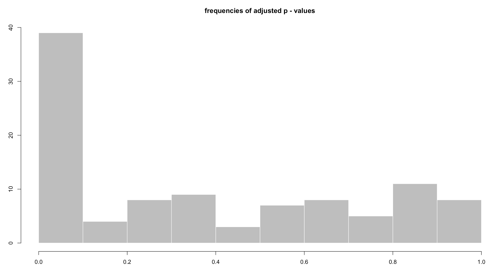
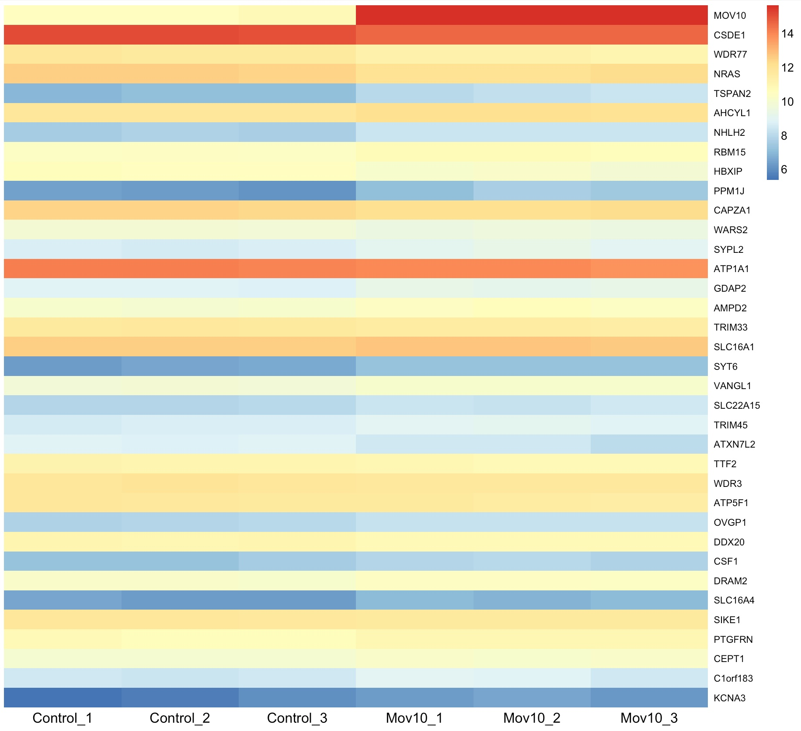
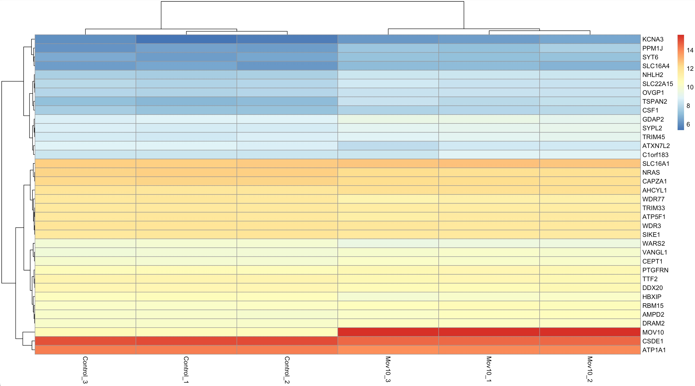
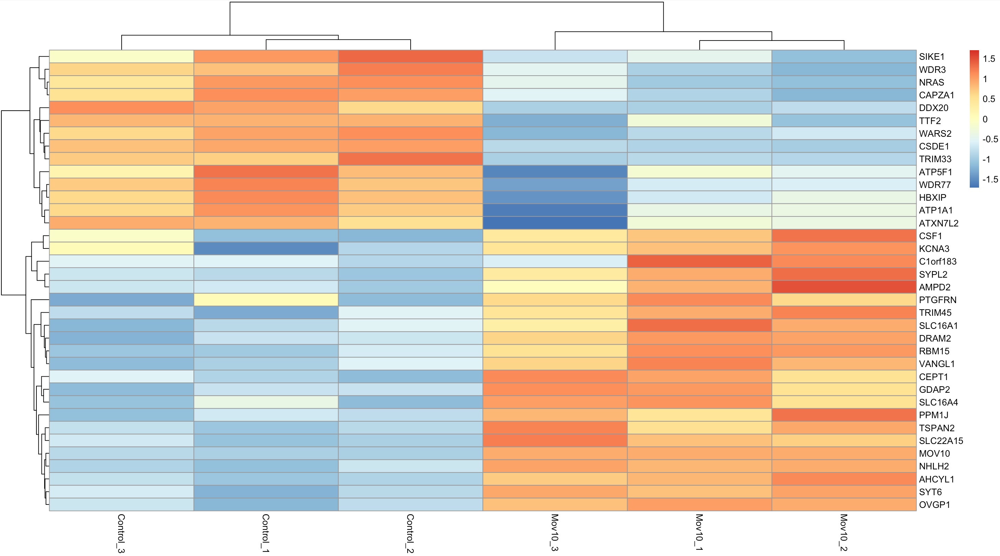

# BIOL*3300 Lab11 F21
## Differential Gene Expression Analysis (DGE)
### Background review
In the last lab, we processed read counts and investigated how samples cluster using PCA and hierarchical clustering methods in R. In addition to performing such exploratory analyses, statistical tests may be used to decide whether a given gene’s expression differs between two (or more) conditions based on the information gleaned from as little as two or three replicates per condition.

The two basic tasks of all differential gene expression (DGE) tools are to:
1. Estimate the magnitude of differential expression between two or more conditions based on read counts from replicated samples, i.e., calculate the fold change of read counts, taking into account the differences in sequencing depth.
1. Estimate the significance of the difference and correct for multiple testing.

In this lab, we assess the difference in expression between the control and treatment groups on a gene-by-gene basis. 
### Estimating the difference between read counts for a given gene
To determine whether the read count differences between different conditions for a given gene are greater than expected by chance, DGE tools must find a way to estimate that difference using the information from the replicates of each condition. The R package, DESeq2, uses regression models that are applied to every single gene. Linear regression models usually take the following typical form: Yij = b0 +b1*xi +eij

Here, Y will entail all read counts for a given gene in individual j of treatment group i. b0 the intercept; xi is the condition (for RNA-seq, this is often a discrete factor, e.g., "WT"  or “mutant", xi would be 0 or 1), b1 is the coefficient that captures the difference between the different conditions. eij is the residual term capturing the deviation from expected and observed values. 

The model shown above could be fitted in R using the function lm(rlog.norm~genotype), where rlog.norm are the Y gene expression values across WT and mutant samples, x. The model will return estimates for both b0 and b1, so that the average expression values of the baseline genotype (e.g., WT = 0) would correspond to Y = b0 + b1 * 0 + e. This is equivalent to Y = b0 (assuming that e is on average zero), thereby demonstrating that the intercept (b0) can be interpreted as the average of our baseline group. b1 represents the difference between groups and will be the coefficient whose closeness to zero will be evaluated during the statistical testing step.

### Testing the null hypothesis
The null hypothesis is that there is no systematic difference between the average read count values of the different conditions for a given gene. Which test is used to assign a p-value depends on the tool, but you can think of the tests as some variation of the well- known t−test (How dissimilar are the means of two populations?) or ANOVA (How well does a reduced model capture the data when compared to the full model with all coefficients?).

Once you’ve obtained a list of p-values for all the genes of your data set, it is important to realize that you just performed the same type of test likely for thousands and thousands of genes. That means, that even if you decide to focus on genes with a p-value smaller than 0.05, if you’ve looked at 10,000 genes that do not differ in expression your final list may contain 0.05 \* 10,000 = 500 false positive hits. To guard yourself against reporting false positives, analysis tools offer a correction for the multiple hypotheses you tested, e.g. in the form of the Benjamini-Hochberg formula that returns genes significant at a given false discovery rate (FDR). You should work with the adjusted p-values rather than the original ones to identify genes for downstream analyses and follow-up studies.

### Running DGE analysis tools 
#### DESeq2 workflow
For our example data set, we would like to compare two treatment groups: "Mov10 over expressed" and "control" samples. When we examine a gene’s fold change, we use the control denominator for the fold change calculation. RNA helicase MOV10 has been implicated in miRNA-mediated translational suppression. MOV10 is thought to facilitate translation suppression by miRNA pathway.

Recall from last lab that we developed a data structure with read counts across all genes across the six samples. This data, RNA_seq_featurecounts.txt, is in the lab10 folder.

```{r}
> library(DESeq2)
> readcounts <- read.table("~/Downloads/RNA_seq_featurecounts.txt",header=TRUE)
> row.names(readcounts) <- readcounts$Geneid
> readcounts <- readcounts[,-c(1:6)]
> names(readcounts) <- c("Control_1","Control_2","Control_3","Mov10_1","Mov10_2","Mov10_3")

> sample_info<-data.frame(condition=gsub("_[0-9]+"," ",names(readcounts)),row.names=names(readcounts))
> DESeq.ds <- DESeqDataSetFromMatrix(countData = readcounts,
                                 colData = sample_info, design = ~ condition)

#The raw count data can be seen using counts(DESeq.ds)
#Counts cannot be directly compared between samples if the samples have different readdepths.

#Use colSums(counts(DESeq.ds)) to investigate if you think the number of mapped reads per 
#sample needs correction.

> DESeq.ds <- estimateSizeFactors(DESeq.ds)
> sizeFactors(DESeq.ds)
```
#### Running the DE analysis
```{r}
> DESeq.ds <- estimateDispersions(DESeq.ds)
> DESeq.ds <- nbinomWaldTest(DESeq.ds)
```
These methods test for a significant difference between the mean expression level of every gene. As with the method described above, genes with large differences in their means between conditions and low differences within conditions are unlikely to be equally expressed between conditions. These genes receive low p values and low adjusted P values.

We can see the results for genes using the command. 
```{r}
> results(DESeq.ds)
```
Here we take the header and the first gene:
```
log2 fold change (MLE): condition Mov10. vs Control. 
Wald test p-value: condition Mov10. vs Control. 
DataFrame with 2330 rows and 6 columns
           baseMean log2FoldChange     lfcSE      stat    pvalue      padj
          <numeric>      <numeric> <numeric> <numeric> <numeric> <numeric>
WASH7P     1.271174      -1.794829   2.03564 -0.881702  0.377938        NA
FAM138F    0.000000             NA        NA        NA        NA        NA
FAM138A    0.000000             NA        NA        NA        NA        NA
OR4F5      0.000000             NA        NA        NA        NA        NA
LOC729737  0.481304       0.673273   3.12070  0.215745  0.829187        NA
...             ...            ...       ...       ...       ...       ...
SH3BP5L    0.141911       -1.04999   4.08047  -0.25732  0.796932        NA
MIR3124    0.000000             NA        NA        NA        NA        NA
ZNF672     0.000000             NA        NA        NA        NA        NA
ZNF692     0.209820       -1.04999   4.08047  -0.25732  0.796932        NA
PGBD2      0.000000             NA        NA        NA        NA        NA
```
We can filter the results of the analysis to only report genes differentially expressed after correcting.

```{r}
# tells you which types of values can be extracted with results()
> resultsNames(DESeq.ds) 
> DGE.results <- results(DESeq.ds,
                       independentFiltering = TRUE,
                       alpha = 0.05)
# first line indicates which comparison was done for the log2FC
> summary(DGE.results)
# the DESeqResult object can basically be handled like a data.frame
> table(DGE.results$padj < 0.05)
```

NAs in the padj column (but values in both log2FC and pvalue) are indicative of that gene being filtered out by the independent filtering [because it was very lowly expressed].

#### Exploratory plots following DGE analysis
Histograms are a simple and fast way of getting a feeling for how frequently certain values are present in a data set. A common example is a histogram of adjusted p-values for each gene comparison.
```{r}
> hist(DGE.results$padj,
    col = "grey" , border = "white" , xlab = " " , ylab = " " ,
    main = "frequencies of adjusted p - values")
```
<center>

</center>

MA plots were originally developed for visualizing cDNA microarray results, but they are also useful for RNA-seq analyses. The MA plot provides a global view of the relationship between the expression change between conditions (log ratios, M) and the average expression level of  the genes (average mean, A). The log2 fold change is on the y-axis over the mean of normalized counts. Genes that pass  the significance threshold (adjusted p.value <0.05) are colored in red.

```{r}
> plotMA(DGE.results, alpha = 0.05, colNonSig = "gray60", colSig = "red",
       main = "Test: adjusted p.value < 0.05", ylim = c(-4,4))
```
<center>

</center>

Heatmaps are a popular means to visualize the expression values across the individual samples. The following commands can be used to obtain heatmaps for rlog-normalized read counts for genes that show differential expression with adjusted p-values <0.05. 

```{r}
# load the library with the aheatmap () function
> install.packages("NMF")
> install.packages("pheatmap")
> library(NMF)
> library(pheatmap)

# aheatmap needs a matrix of values , e.g. , a matrix of DE genes with the
# transformed read counts for each replicate
# sort the results according to the adjusted p-value
> DGE.results.sorted <- DGE.results[order(DGE.results$padj), ]

# identify genes with the desired adjusted p-value cut-off
> DGEgenes <- rownames(subset(DGE.results.sorted , padj < 0.05))

# extract the normalized read counts for DE genes into a matrix
> hm.mat_DGEgenes <- log.norm.counts[DGEgenes, ]

# plot the normalized read counts of DE genes sorted by the adjusted p-value
> pheatmap(hm.mat_DGEgenes , Rowv = NA , Colv = NA)
```
<center>

</center>

```{r}
# combine the heatmap with hierarchical clustering
# add dendrograms to rows and column
> pheatmap(hm.mat_DGEgenes,
    Rowv = TRUE , Colv = TRUE,                
    distfun = "euclidean" , hclustfun = "average")
```
<center>

</center>


We can scale the read counts per gene to emphasize the sample-type-specific differences. Note the same information can be displayed and interpreted in quite different ways!  

```{r}
# scale the read counts per gene to emphasize the sample-type-specific
# differences
> pheatmap (hm.mat_DGEgenes ,
    Rowv = TRUE , Colv = TRUE ,
    distfun = "euclidean" , hclustfun = "average",
    scale = "row" ) 
# values are transformed into distances from the center
# of the row - specific average : ( actual value - mean of the group ) /
# standard deviation
```

<center>

</center>


When you finish this lab session, you can delete these packages to save your storage space in your computer:
```{r}
> remove.packages(c("DEseq2","ggplot2","pheatmap","NMF")) 
``` 
 
### Assignment for Lab 11
**Given our description of [Kenny PJ et al., Cell Rep 2014](https://www.ncbi.nlm.nih.gov/pubmed/25464849), what gene is drastically different and why does this make sense given the experiment?**


### References
These lab materials are derived from the following website:
1. http://www.ncbi.nlm.nih.gov/pubmed/25464849
1. https://chagall.med.cornell.edu/RNASEQcourse/Intro2RNAseq.pdf
1. https://github.com/friedue/course_RNA-seq2019/tree/master/Day04