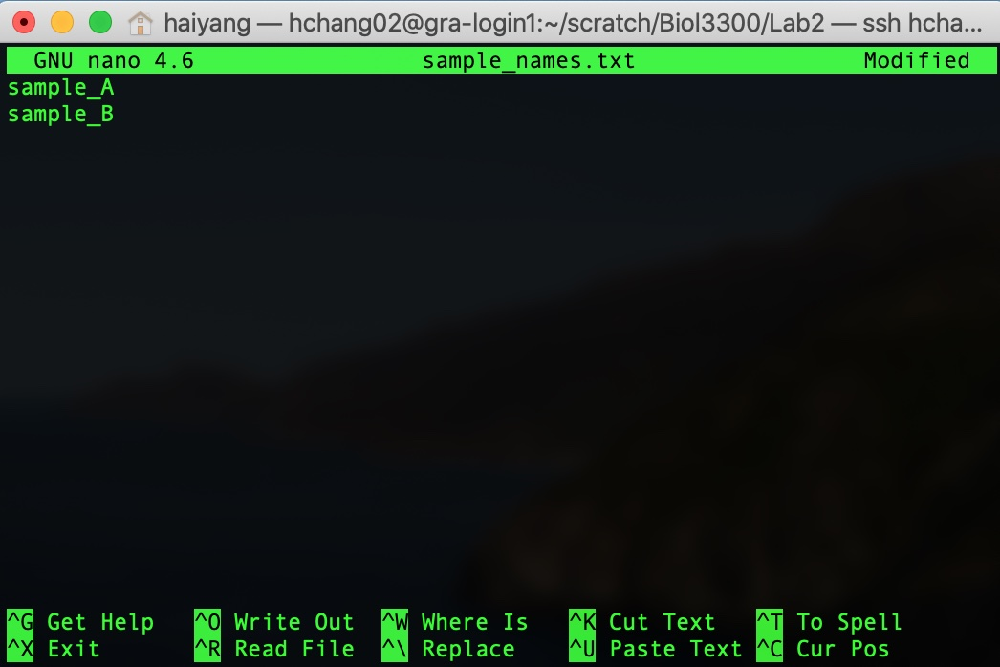

# BIOL*3300 Lab2 F21
## Advanced Command Lines
To be sure we are still working in the same place, let's login in Compute Canada Graham account and run the following commands:
```console
   cd scratch/Biol33001
   mkdir Lab2
   cd Lab2
   pwd
```
### A terminal text editor
It is often very useful to be able to generate new plain-text files quickly at the command line, or make some changes to an existing one. One way to do this is using a text editor that operates at the command line. Here we’re going to look at one program that does this called **nano**.

When we run the command nano it will open a text editor in our terminal window. If we give it a file name as a positional argument, it will open that file if it exists, or it will create it if it doesn’t. Here we’ll make a new file:
```console
nano sample_names.txt
```
When we press return, our environment changes to this:

Now we can type as usual. Type in a couple of sample names, one on each line (it doesn’t matter what the names are):


Afterwards, to save the file and exit, we need to use some of the keyboard shortcuts listed on the bottom. "WriteOut" will save our file, and the ^O represents pressing **control and o** together (it doesn’t need to be a capital "O"). This will ask us to either enter or confirm the file name, we can just press return. Now that it is saved, to exit we need to press **control and x** at the same time.

And now our new file is in our current working directory:
```console
ls
less sample_names.txt
```
### Using wild card characters
Wildcards as used at the command line are special characters that enable us to specify multiple items very easily. The **\*** and **?** are probably the most commonly used, so let’s try them out!
Firstly we create several files with touch:
```console
    touch bat bit but beat beet cat
```
##### The asterisk (*)
As we’ve seen, ls lists the contents of the current working directory, and by default it assumes we want everything:
```console
    ls -l 
```
But we can be more specific about what we’re interested in by giving it a positional argument that narrows things down. The * wildcard can help us with that. Let’s say we only want to look for files that starts with "b":
```console
    ls b*
```
What this is saying is that if it starts with b then we want it. At the command line, the * means any character, any number of times (including 0 times).
##### The question mark (?)
At the command line, the ? wildcard represents any character that appears only one time.
Here’s an example:
```console
    ls b?t
```
What this is saying is that any character is allowed to appear one time, if it starts with b and ends with t we want it. 
Try the following commands amd compare their differences:
```console
    ls b??
    ls *at
    ls b??t
```
### Rsync commands to transfer files
The rsync can do a remote file copy and also copies directories. You need to provide correct paths for downloading. Here is an example of rsync command for downloading M. domestica chromosome 7 annotation:
```console
    rsync -av rsync://ftp.ensembl.org/ensembl/pub/release-101/gff3/monodelphis_domestica/
    Monodelphis_domestica.ASM229v1.101.primary_assembly.7.gff3.gz .
```
If you copy and paste these commands, please note there is **no space after the last "/"** and don't forget the **.** representing the current directory. 
#### Compressed data
You should now have the chromosome 7 annotation file in this directory. The file has a postcript .gz. This postscript means that the fileis compressed. 
```console
    gunzip Monodelphis_domestica.ASM229v1.101.primary_assembly.7.gff3.gz .
```
#### Looking at the data with less commands:
```console
    less Monodelphis_domestica.ASM229v1.101.primary_assembly.7.gff3
```
Try the following **keys**: 
**space** down one page
**j** down one line
**b** up one page
**k** up one line
**q** quit
**h** access help page**
**g** jump to start
**G** jump to end of file
**/** start searching forward
**?** start searching back
**-N**  option uses line numbers
**-n** option removes them

In the Gff3 file annotation, the feature is in column 3 and its chromosomal position is in columns 4 and 5. We can see different feature types and their positions. Here are some questions you can find anwsers with less commands:

1. About how long is this chromosome based on the position of the last feature? (**G**)
1. What is the first feature? (**g**)
1. What are the coordinates for the gene "ENSMODG00000024499?" (**/ENSMODG00000024499 or ? /ENSMODG00000024499**)
1. Go to the 100th line in the file. (**Type -N and -n** and **100g**)
#### Looking at the data with head and tail
We will often want to get a look at a file to see how it’s structured. We’ve already used a very common tool for peeking at files, the head command. There is also tail, which prints the last 10 lines of a file:
```console
    head Monodelphis_domestica.ASM229v1.101.primary_assembly.7.gff3
    tail Monodelphis_domestica.ASM229v1.101.primary_assembly.7.gff3 
```
This is especially helpful if a file is particularly large, as head will just print the first ten lines and stop. This means it will be just as instantaneous whether the file is 10kB or 10GB.

You can also specify a number of lines to print with option -n: 
```console
    head -n 5 Monodelphis_domestica.ASM229v1.101.primary_assembly.7.gff3
    tail -n 5 Monodelphis_domestica.ASM229v1.101.primary_assembly.7.gff3 
```
### Counting the number of lines
The **wc** (for word count) command is useful for counting how many lines, words, and characters there are in a file:
```console
    wc Monodelphis_domestica.ASM229v1.101.primary_assembly.7.gff3
    wc -l Monodelphis_domestica.ASM229v1.101.primary_assembly.7.gff3 
```
Adding the optional flag -l will print just how many lines are in a file. We could find this out by running: 
```console
    man wc
    wc --help 
```
### The sort command
Let's make a file by **nano temp**. Inside temp file, please type or paste as the following:
```console
echo 123 again 
echo 75 there 
away 2 bash 
redo 445 there 
again 62 there 
stop 18 over
```
This is sorting by the first characters in the first column:
```console
    head temp
    sort temp
```
We can sort by column 3:
```console
    sort -k3 temp
```
For column 2, the option -n tells sort to compare according to numerical value:
```console
    sort -k2 -n temp
```
or you can simplify options by:
```console
    sort -k2n temp
```
You can also reverse the result of comparisons in column 2:
```console
    sort -k2 -n -r temp
```
or you can simplify options by:
```console
    sort -k2nr temp
```
Sorts by the third column then the second column: 
```console
    sort -k3 -k2n temp
```
### Cutting columns from data set
cut is a command that’s great for manipulating columns. The required arguments for cut are which columns we want, and from which file. Here’s how we can use cut to pull out the column with numbers (column 2) from temp file. Here we are specifying which column we want with the -f parameter (for field). By default, cut recognizes **tab** characters and cuts them. The delimitor option (-d) can change this behaviour. Here, I give **"space"** as the delimitor.
```console
    cut -f2 -d" " temp
```
We can also specify multiple individual columns (column 1 and 3) with **space** as delimitor: 
```console
    cut -f1,3 -d" " temp
```
We can also specify multiple individual columns (column 1 and 3) with **space** as delimitor: 
```console
    cut -f1,3 -d" " temp
```
And a range of columns if we join them with a dash:
```console
    cut -f1-3 -d" " temp
```
The cut and sort command can be used together. For example, in position three of the gff file, the "feature" is listed e.g. Here is a piece of a .gff file. 
```console
    7 ensembl lnc_RNA 52843 95412
    7 ensembl exon 52843 53439
    7 ensembl exon 94635 95412
```
Let's take a look at: Monodelphis_domestica.ASM229v1.101.primary_assembly.7.gff3.  
This file has some descrptive information we don't want. This information has # at the beginning of the line. 

We will talk about grep next time, but I will use it below. **grep** examines each line of a file and sees if a line matches a pattern. If it does, grep returns the line. grep can be "reversed" so it returns lines that do not match a pattern. Here the pattern I want to match is #. To use this character, I need to escape it. Note the **>** symbol sends the output of a command into a file.
```console
    grep -v \# Monodelphis_domestica.ASM229v1.101.primary_assembly.7.gff3 > gff3file
    head gff3file
```
We can use the pipe **|** to transfer data from one command to another. Here I extract the names of all the features and take the top 10.
```console
    cut -f3 gff3file | head
```
We can also answer questions such as "What are the different features in the annotation" with a sort option (-u). The sort option -u outputs lines with consecutive duplicates removed.
```console
    cut -f3 gff3file | sort -u 
```
Furthermore we could count the number of feature types:
```console
    cut -f3 gff3file | sort -u | wc -l
```
Let's say we want a file with only the features and their start and end positions: 
```console
    cut -f3,4,5 gff3file | head
```
or 
```console
    cut -f3-5 gff3file | head
```
or we can **paste** things together horizontally with a delimiter in between them (a tab by default).
```console
    cut -f3 gff3file > col1
    cut -f4 gff3file > col2
    cut -f5 gff3file > col3
    paste col1 col2 col3 | head
```
As noted before, sometimes we may be interested in a specific element in a column that is composed ofmultiple elements. For example, the last column of each gff3 row has annotation information separated by ";". To get the 1st element of this column:
```console  
    cut -f9 gff3file | head
    cut -f9 gff3file | cut -d ';' -f1 | head
```
### Reference
These lab materials are from the following tutorials:
1. https://j.p.gogarten.uconn.edu/mcb5472_2018/current.pdf
1. https://astrobiomike.github.io/unix/getting-started