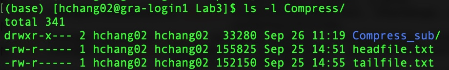

# BIOL*3300 Lab3 F21
## Advanced Command Lines
To be sure we are still working in the same place, let's login in Compute Canada Graham account and run the following commands:
```console
   cd scratch/Biol3300
   mkdir Lab3
   cd Lab3
   pwd
```

### Compressed Files with gzip
Previously, we use gunzip to extract the gff3 file from Ensembl. These files had a.gz suffix which indicated the data had been compressed. We may want to compress files. How do we do it?
Let's first create some data in some directories.
```console
   cp ~/scratch/Biol3300/Lab2/gff3file .
   mkdir -p Compress/Compress_sub
   head -n 1000 gff3file > Compress/headfile.txt
   tail -n 1000 gff3file > Compress/tailfile.txt
   cp Compress/headfile.txt Compress/Compress_sub/headfile2.txt
```
We can compress the file headfile.txt into headfile.txt.gz:
```console
    gzip Compress/headfile.txt
    ls -l Compress/
```
And we decompress the file by:
```console
    gunzip Compress/headfile.txt.gz
    ls -l Compress/
```
We can compress all the txt file and decompress all the gz file by:
```console
    gzip Compress/*.txt
    ls -l Compress/
    gunzip Compress/*.gz
    ls -l Compress/
```
We can also compress all the filenames in the directory and its subdirectories with -r (for recursive) option. This option is used to gzip the files in adirectory tree individually.
```console  
    gzip -r Compress
    ls -l Compress/
    ls -l Compress/Compress_sub
```
To uncompress the file, we can also add option -d (for decompress):
```console 
    gzip -dr Compress
    ls -l Compress/
    ls -l Compress/Compress_sub
```
More options of gzip: 
```console  
    man gzip
    gzip --help
```
### Compressed Files with tar
Note that the **gzip -r** command compressed the files in the directories. It did not compress the directories into one file. The command tar will put together files and directories. It makes a "tape archive". 

Let’s create a tar file of the Compress directory and all its contents:
```console  
    tar -cvf compress_archive.tar Compress
    ls
```   
This creates a new file, and the options:
**-c** is "create archive"
**-v** is verbose
**-f** is create archive with the given filename

We can extract the archives contents by:
```console  
    mv Compress Compress_old
    tar -xf compress_archive.tar
    ls 
``` 
These steps will create a new Compress directory in the current directory. We can archive and compress with one command:
```console  
    tar -czf compress_archive.tar.gz Compress
    ls 
``` 
And decompress and extract from archive with one command.
```console 
    mv Compress Compress_old_again
    tar -xzf compress_archive.tar.gz
    ls -l Compress
```
Summary of some tar options:
**-c:** Create a new archive containing the specified items.
**-x:** Extract to disk from the archive.
**-f:** Read the archive from or write the archive to the specified file
**-v:** Produce verbose output.
**-z:** De/Compress the resulting archive with gzip

More options of tar: 
```console  
    man tar
    tar --help
```

### File Permissions
In Unix, an individual can be a **user (u)**; an individual can be in a **group (g)**; and an individual can have an **other (o)** classification. These classifications affect what the individual can do with files and directories.

Files and directories have three types of permissions: **read (r)**, **write (w)** and **execute (x)**. We can see these permissions when we type: 
```console 
    ls -l Compress
```


After the character signalling if the entry is a file (-) or directory (d), the next three characters signify read, write, execute permission for the user followed by the group followed by other. In this case, I can read and write the file I made ( **headfile.txt** ), but I can not execute (rw-). For the files the user creates, the user will have read and write permission automatically. The user does not have execute permission by default. 

On this Compute Canada Graham server, the files and directories I make are available to view by a member of the same group as me only. These people do not have execute permissions or permissions to write to a file or directory. We can see read is only available to members of my group (r--).

To enter a directory, one needs execute permission. The text above, "drwxr-x---" indicates that user can enter, read, and write to the directory. Group members can open the directory.


#### Changing permissions
The **chmod** (for change modes) command changes permissions of files and directories. The base method is "u/g/o classification" "add or remove" "execute/read/write"

Add execute permission for the user:
```console 
    cd Compress
    chmod u+x headfile.txt 
    ls -l
``` 
Remove read permission for the group:
```console 
    chmod g-r headfile.txt 
    ls -l
``` 
Add write permission for the user:
```console 
    chmod o+w headfile.txt
    ls -l
``` 
Remove write for all classifications:
```console 
    chmod a-w headfile.txt
    ls -l 
``` 
Set all classifications for read/write/execute:
```console 
    chmod u=rwx,g=rx,o=r headfile.txt
    ls -l
``` 
We can also use the digits 7, 5, and 4 to represent the permissions for the user, group, and others, in that order. Each digit is a combination of the numbers 4, 2, 1, and 0:
4 stands for "read",
2 stands for "write",
1 stands for "execute",
0 stands for "no permission".

```console 
    chmod 754 tailfile.txt 
``` 
You can also change the permissions for the whole directory Lab3 with -R option:
```console 
    cd ../..
    chmod -R 747 Lab3
```  
I have changed the permissions for my folder Lab3, please copy this "superheroes.txt" file to your current Lab3 folder:
```console 
    cp /home/hchang02/scratch/Biol3300/Lab3/superheroes.txt .
``` 
If you can't copy the above file, please create the file with **nano superheroes.txt**, by typing or pasting as the following:
```console
Batman  Bruce Wayne Hero    DC
Invisible Woman	Susan Storm Richards    Hero    Marvel
Supergirl	Linda Danvers	Hero	DC
Superman	Clark Kent	Hero	DC
Wonder Woman    Diana Prince	Hero	DC
Iron Man    Tony Stark	Hero	Marvel
```
### The simplest "grep" is to choose a pattern and a file
**grep** (for global regular expression) is a search tool. It looks through text files for strings (sequences of characters). In its default usage, grep will look for whatever string of characters you give it (1st positional argument), in whichever file you specify (2nd positional argument), and then print out the lines that contain what you searched for. Let’s try it:
```console
    grep Woman superheroes.txt
```
Let's search for man. If we are looking for lower case matches, then we would use 'man'. If we want to match letters regardless of capitalization '-i man'. The -i flag means "ignore case".

```console
    grep -i man superheroes.txt
    grep man superheroes.txt
```
You may surprised to see some of these matches. We are detectng man in phrases.
#### The -v option
The v option turns the logic of the grep command upside down; it shows lines that don't match the pattern.
```console
    grep -iv man superheroes.txt
```
#### Count pattern matches
```console
    grep -ci man superheroes.txt
```

#### What line numbers have a matching pattern?
```console
    grep -n man superheroes.txt
    grep -vn man superheroes.txt
```
#### Matching pattern positions
Sometimes we want to match a character/letter at the beginning of the text.
```console
    grep ^Super superheroes.txt
```

Sometimes we want to match a character/letter at the end of the text
```console
    grep C$ superheroes.txt
```

More options of grep: 
```console  
    man grep
    grep --help
```

Grep Options:
**-c** prints a count of matching lines.
**-i** ignore case.
**-A** prints lines after the match.
**-B** prints lines before the match.
**-v** prints those lines that don't have pattern.
**-n** prints line numbers.

Try some grep commands yourself:
```console  
    grep -B 2 Man superheroes.txt
    grep -A 1 Bat superheroes.txt
    grep -B 2 -n Man superheroes.txt
``` 

### Redirecting input and output

#### Sandard output
Unix treats the output of programs likes a stream of data that can be redirected to different places. The official term for the output of any command is standard output (stdout). Your computer screen is the default destination for stdout.

Rather than have the output go to the screen, we have used the redirect operator to send it to a new file.
```console
    grep DC superheroes.txt > DC_superheroes.txt
```
A somewhat brutal feature of the redirect operator is if you accidentally redirect a commands output to a file that exists, it will clobber it. Redirection will re-write files, even if there is no output!

To append to an existing file, use >> 
```console
    echo "Captain America   Steve Rogers    Hero    Marvel" >> superheroes.txt
```

#### Standard input

The standard input is a data stream, usually text, that can be provided as input for UNIX program. By default, stdin is from the keyboard, but differs from the input to commands .e.g. less superheroes.txt. Filename is an argument to the command, but it is not the standard input.

Not many commands take standard input, **tr** (for translate) is one. The tr command specifies a range of characters that are to be changed into others. It requires some typed input after the command has started. We can redirect standard input to come from a file with "<" the redirect operator. For example, if we want to convert m to M, one can use the following command.
```console
    tr 'm' 'M' < superheroes.txt
```
You can redirect both stdin and stdout.
```console
    tr 'm' 'M' < superheroes.txt > processed.txt 
```

### Reference
These lab materials are from the following tutorials:
1. https://j.p.gogarten.uconn.edu/mcb5472_2018/current.pdf
1. https://astrobiomike.github.io/unix/getting-started