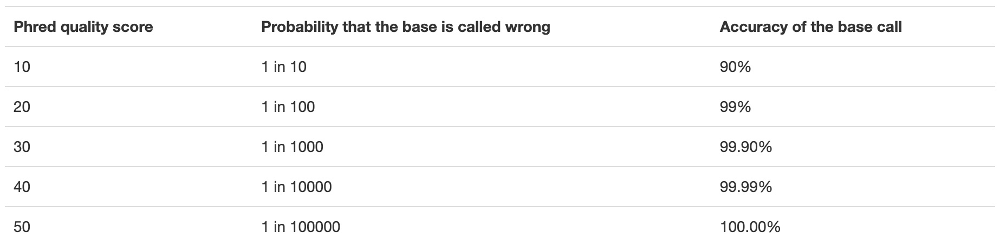

# BIOL*3300 Lab6 F21
## Variant Calling Practice on Compute Canada 
#### Background
In this lab, we will initiate the process of analyzing short read data to call single nucleotide polymorphisms. This series of labs is based on the published protocol:

[Rochette, N.C. and Catchen, J.M., 2017. Deriving genotypes from RAD-seq short-read data using Stacks. Nature Protocols, 12(12), pp.2640-2659.](https://www.nature.com/articles/nprot.2017.123)

The authors work on population genetics and are interested in the factors that have affected fish populations. We use the sequencing data from their paper:

[The population structure and recent colonization history of Oregon threespine stickleback determined using restriction-site associated DNA-sequencing. Mol. Ecol. 22, 2864–2883 (2013).](https://pubmed.ncbi.nlm.nih.gov/23718143/)

In our case, we are interested in the analyses to obtain SNPs not the population genetics analyses. The data set includes 78 samples from four populations along the coast of Oregon (USA), of which two are oceanic (‘Cushman Slough’ (CS) and ‘South Jetty’ (SJ)) and two are freshwater (‘Winchester Creek’ (WC) and ‘Pony Creek Reservoir’ (PCR)). We will work with a small number of samples to show how the process works.

### Lab Preparation of the environment and of the data
It is good to be organized, so you don’t spend too much time looking for things either now or in the future.

#### Step1 Create a directory and subdirectories for the analysis
Within your scratch/Biol3300 directory, create the SNP_lab directory, so it has 7 subdirectories within it. The purpose of these directories will become clear. 

The structure of SNP_lab directory:
```console
    SNP_lab/
        alignments/
        cleaned/
        genome/
        info/
        raw/
        stacks_ref/
        tests_ref/
```
I have created this SNP_lab directory and you can copy that to your scratch/Biol3300 folder directly with:
```console
    cp -r /scratch/hchang02/Biol3300/SNP_lab/ ~/scratch/Biol3300
```
#### Step2 Starting with some data
Sequences from three Illumina lanes are already in the raw folder, and if you list the contents of this directory:
```console
    cd ~/scratch/Biol3300/SNP_lab/raw
    ls
```
You will see:  
```console
    lane1/
    lane2/
    lane3/   
```
Let's navigate into the lane 1 directory. These files are compressed and have the suffix ".fq.gz" which means they are compressed fastq files. 

You can take a look at compressed files without decompressing them by using the zless command. This is 'less' applied to compressed files. Press q to quit from zless. Similarly, you can use zcat.

```console
    cd lane1
    zless lane1_NoIndex_L001_R1_001.fq.gz
```
##### FASTQ file
Fastq format was developed by Sanger institute in order to group together sequence and its quality scores (Q: phred quality score). In fastq files each entry is associated with 4 lines.

**Line 1** begins with a '@' character and is a sequence identifier and information about the read
**Line 2** The actual DNA sequence
**Line 3** begins with a '+' character and is optionally followed by the same sequence identifier (and any additional description) again.
**Line 4** encodes the quality values for the sequence in Line 2, and must contain the same number of symbols as letters in the sequence.

We can view the first complete read in one of the files our dataset by using head: 
```console
    zless lane1_NoIndex_L001_R1_001.fq.gz | head -n 4 
```
The output is: 
```console
@HWI-ST0747:233:C0RH3ACXX:1:1101:10000:10465 1:N:0:
GGAGCAGAGAGGAGACTAAAGGGGAGCAGAGGGAAGACTAAAGGGGAGCAGAGGGAAGACTAAAGGGGAGCAGAGGAGAGACTAAAGGGGAGCAGAGAGGA
+
CCCFFFFFHHHHHJJJJJJIJJJJIJJGIGIIJ@GHIJJJJJJIJJGHGHHHHFF8BCEEECDDDCDDB@BDDCDBA@BDDDDDDDDDDD-<B?C??9?@8
```
**But what does this quality score mean?**
A quality score (PHRED scale) for each base pair. It indicates how confident we can be that the base was sequenced and identified correctly.
Q = -10log­10(p), where p is the probability that the corresponding base call is incorrect.
<center>

</center>
The numerical value assigned to each of these characters depends on the sequencing platform that generated the reads. The sequencing machine used to generate our data uses the standard Sanger quality PHRED score encoding, using Illumina version 1.8 onwards. Each character is assigned a quality score between 0 and 41 as shown in the chart below.

```console
Quality encoding: !"#$%&'()*+,-./0123456789:;<=>?@ABCDEFGHIJ
                   |         |         |         |         |
Quality score:    01........11........21........31........41
```
Now let's decompress the file:
```console
    gunzip lane1_NoIndex_L001_R1_001.fq.gz 
```
* How much smaller was the compressed file compared to this file? 
* What is the last read in the lane1_NoIndex_L001_R1_001.fq file? How confident are you in this read?

#### Step3 Barcodes files
In RADseq and GBS, the sequencing machine produces more sequences than we would want for a single sample. The clever solution was to attach a short series of nucleotides that are unique to each sample at the beginning and ending of each sample’s cDNA. One pools the samples before sequencing. After sequencing, one sorts the sequences based on their barcodes into their proper sample.

There is a barcodes file for each lane in the **info/**.
In the lane 1 folder there are 10 files, and we are looking at one of them. We will be dealing with part of lane 1, R1_001. Let's check the barcodes file for lane1:

```console
    cd ../../info
    head barcodes.lane1.tsv
```
The output is
```
CTCGCC  sj_1819.35
GACTCT  sj_1819.31
GAGAGA  sj_1819.32
GATCGT  sj_1819.33
GCAGAT  sj_1819.34
GCCGTA  sj_1819.36
GCGACC  sj_1819.37
GCGCTG  sj_1819.38
GCTCAA  sj_1819.39
GGACTT  sj_1819.40
```
* sj refers to "South Jetty", a location noted above.
* We can see that sample 1819.35 was "barcoded" with CTCGCC.

Both RADSeq and GBS use restriction enzymes. We expect all reads to start with a 6-nt barcode, followed by the six nucleotides (TGCAGG) that should remain of the SbfI restriction site (CC^TGCAGG) in the DNA fragments after ligation.

The expected read structure is a total read length of 101, as following:
```
<6-nt barcode>TGCAGG<unique 89-nt sequence> 
``` 
Look at the first four reads in the file lane1_NoIndex_L001_R1_001.fq. Do you see the TGCAGG nucleotides following the barcode, as expected?
```console  
    cd ../raw/lane1
    head -n 16 lane1_NoIndex_L001_R1_001.fq
``` 
We can see that sample 1819.35 from "South Jetty", a location noted above, was "barcoded" with CTCGCC, and let’s see if we have reads that start with this barcode in the file.
```console  
    grep -E '^CTCGCC' lane1_NoIndex_L001_R1_001.fq
``` 
Type control c to exit! How many reads are with this barcode?

Compare the number of reads with this barcode compared to a non-barcode sequence such as GGGGGG.
```console  
    grep -E '^GGGGGG' lane1_NoIndex_L001_R1_001.fq | wc -l 
```
#### Step4 Clean and demultiplex
Move into your **cleaned/** directory.
```console  
    cd ../../cleaned
``` 
We will use software to sort our data. The program we will run is called process_radtags. It is part of the **Stacks** software package.

##### Environment modules of Compute Canada
Using modules is generally something that is used on Compute Canada sever and generally installed by the system’s administrator. On your own machine, you would need to install the software. Happily, stacks is installed on the Compute Canada server. It is part of a module system. The module system allows to only 'load' software when needed as well as to make multiple versions of software available at the same time. It basically changes your PATH variable (and possibly other environment variables) so that the shell searches the correct directories for the software you want to use.

First, take a look at all the software available on Graham:
```console
    module avail 
```
This is a list of all the software (with different versions) that you can access. The format of 'modules' is software/version here you can see many softwares have their different versions installed. When you load a module without specifying a version, it will load the default (generally the latest) version.
```console
    module load stacks
```
Now, call the process_radtags unit of Stacks:
-	(-p) The path to a directory that contains the files you want to process. 
-	(-b) The barcodes file. 
-	(-o) The place you want the processed files to go.
-	(-e) The restriction enzyme used in library preparation (so it can be filtered out)
-	(-c) The option to remove any sequences with Ns
-	(-q) The option to discard reads with low quality (Q) scores.
-	(-r) The option to rescue barcodes and RAD-Tags

To save the time, we create an test folder and copy lane1_NoIndex_L001_R1_001.fq file into this folder:
```console
    mkdir ../raw/lane1/test/
    cp ../raw/lane1/lane1_NoIndex_L001_R1_001.fq ../raw/lane1/test/
```
#### Demultiplexing fastq file with its barcodes info 
Instead of making a huge command line, it may be easier to make variables and assign them values.
```console
    raw_dir=../raw/lane1/test
    barcodes_file=../info/barcodes.lane1.tsv
    process_radtags -p $raw_dir -b $barcodes_file -o ./ -e sbfI -c -q -r
```
* This takes a little while to run, so be patient. 
* Note instead of using relative paths, you can also add absolute paths to your "raw_dir" and "barcodes_file". 
* Both ".fq" and "fq.gz" files can be used to perform demultiplexing. 

And this is my output:
```
Processing single-end data.
Using Phred+33 encoding for quality scores.
Found 1 input file(s).
Searching for single-end, inlined barcodes.
Loaded 24 barcodes (6bp).
Will attempt to recover barcodes with at most 1 mismatches.
Processing file 1 of 1 [lane1_NoIndex_L001_R1_001.fq]
  Processing RAD-Tags...1M...2M...3M...
  3888416 total reads; -321836 ambiguous barcodes; -78281 ambiguous RAD-Tags; +83085 recovered; -352260 low quality reads; 3136039 retained reads.
Closing files, flushing buffers...
Outputing details to log: './process_radtags.Example.log'

3888416 total sequences
 321836 barcode not found drops (8.3%)
 352260 low quality read drops (9.1%)
  78281 RAD cutsite not found drops (2.0%)
3136039 retained reads (80.7%)
```
There are two types of files that come from this command.
First, you get a log of the barcodes provided and the number of reads that match to each.
```console
    less process_radtags.Example.log
```
Second, you get a list of samples, e.g. sj_1483.01.fq.gz or sj_1484.02.fq.gz
How many reads are in sj_1483.01.fq.gz?
```console
    zcat sj_1483.01.fq.gz | grep '^@' | wc -l
```
Do the sequences in these files have the barcodes like the original sequences or have they been removed?
### Assignment for Lab 6
**Please upload your screen shorts of command lines and outputs of demutiplexing lane2_NoIndex_L002_R1_001.fq with barcodes.lane2.tsv file. Note your screen shots should include your username in the terminal**


### Reference
These lab materials are from the following papers and website:
1. [Rochette, N.C. and Catchen, J.M., 2017. Deriving genotypes from RAD-seq short-read data using Stacks. Nature Protocols, 12(12), pp.2640-2659.](https://www.nature.com/articles/nprot.2017.123)
1. [The population structure and recent colonization history of Oregon threespine stickleback determined using restriction-site associated DNA-sequencing. Mol. Ecol. 22, 2864–2883 (2013).](https://pubmed.ncbi.nlm.nih.gov/23718143/)
1. https://docs.computecanada.ca/wiki/Utiliser_des_modules/en

