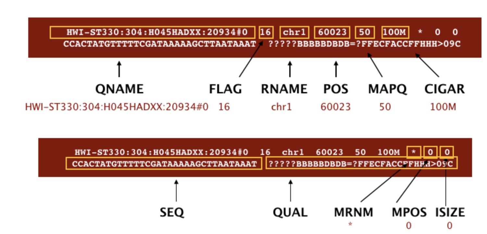
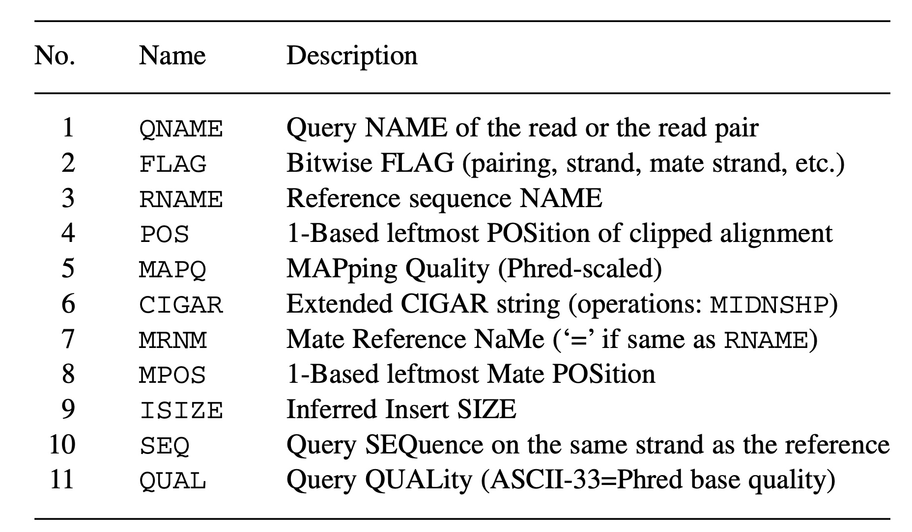

# BIOL*3300 Lab7 F21
## Variant Calling Practice on Compute Canada 
### Background review
In this lab, we will continue the process of analyzing short read data to call single nucleotide polymorphisms. This series of labs is based on the published protocol:

[Rochette, N.C. and Catchen, J.M., 2017. Deriving genotypes from RAD-seq short-read data using Stacks. Nature Protocols, 12(12), pp.2640-2659.](https://www.nature.com/articles/nprot.2017.123)

The main goal of this lab is find alignment sequence reads and call nucleotide polymorphisms between sequence reads and the reference genome.

In the last lab, you processed reads from one lane of Illumina sequence data. Reads from different samples were sequenced together and deposited in one file. In the last lab, barcodes were used to sort the reads into distinct samples.

From last week, you should also have a directory structure such as this:
```console
SNP_lab/
    alignments/
    cleaned/
    genome/
    info/
    raw/
    stacks_ref/
    tests_ref/
```

The purpose of this project is to identify SNPs between samples. The first step is to find out where the reads map in the genome.

To do this, we will use the software bwa to align reads to the genome. We will align only a subset of these samples. The alignment requires: getting the genome to which you want to align; indexing the genome, so the aligner can use it; and aligning reads from your samples to the genome.


### Step4 Downloading the reference genome
Download the reference genome sequence of your organism. This is a FASTA (.fa or .fa.gz) file that can be obtained from the sequence or genome databases. In our case, we download the G. aculeatus, "three spined stickleback", reference genome from the Ensembl FTP site; the name of the file is Gasterosteus_aculeatus.BROADS1.dna.toplevel.fa, and for tractability we do not change it. We place this file in the genome/ directory.

Move into your **genome/** directory and download the genome file with **wget**: (Note there is no space between gasterosteus_aculeatus/ and dna/)
```console  
    cd ~/scratch/Biol3300/SNP_lab/genome
    wget "ftp://ftp.ensembl.org/pub/release-87/fasta/gasterosteus_aculeatus/
    dna/Gasterosteus_aculeatus.BROADS1.dna.toplevel.fa.gz"
    gunzip Gasterosteus_aculeatus.BROADS1.dna.toplevel.fa.gz
```

Note if you can't download the genome file, you can also copy that from my directory: (Don't forget the **.** ,which refers to your current directory)
```console
    cp /scratch/hchang02/Biol3300/SNP_lab/genome/Gasterosteus_aculeatus.BROADS1.dna.toplevel.fa .
```
Take a look at the different sequences that make up the genome.
```console
    grep '>' Gasterosteus_aculeatus.BROADS1.dna.toplevel.fa | head 
    grep '>' Gasterosteus_aculeatus.BROADS1.dna.toplevel.fa | tail
```
**Can you say what a [scaffold](https://mycocosm.jgi.doe.gov/help/scaffolds.jsf) is compared to a "group: sequence, for example, "groupXXI dna"?**


### Step5 Indexing the reference genome 
We will use the BWA-MEM algorithm to align reads. Our first step is to index the reference genome by using software [BWA](http://bio-bwa.sourceforge.net/bwa.shtml). Indexing allows the aligner to quickly find potential alignment sites for query sequences in a genome, which saves time during alignment. Indexing the reference only has to be run once, but it takes a while. 

```console
    module load bwa
    genome_fa=Gasterosteus_aculeatus.BROADS1.dna.toplevel.fa
    bwa index -p ./gac $genome_fa 
```
* **index:** Index database sequences in the FASTA format.
* **-p:** Prefix of the output database 
* gac is the database name including a series of files base on Gasterosteus_aculeatus, you can name what you like.

While the index is created, you will see output that looks something like this:
```console
[bwa_index] Pack FASTA... 3.55 sec
[bwa_index] Construct BWT for the packed sequence...
[BWTIncCreate] textLength=923066896, availableWord=76950264
[BWTIncConstructFromPacked] 10 iterations done. 100000000 characters processed.
[BWTIncConstructFromPacked] 20 iterations done. 200000000 characters processed.
[BWTIncConstructFromPacked] 30 iterations done. 298325216 characters processed.
[BWTIncConstructFromPacked] 40 iterations done. 386832976 characters processed.
[BWTIncConstructFromPacked] 50 iterations done. 465494896 characters processed.
[BWTIncConstructFromPacked] 60 iterations done. 535405808 characters processed.
[BWTIncConstructFromPacked] 70 iterations done. 597538784 characters processed.
[BWTIncConstructFromPacked] 80 iterations done. 652758736 characters processed.
[BWTIncConstructFromPacked] 90 iterations done. 701834336 characters processed.
[BWTIncConstructFromPacked] 100 iterations done. 745448832 characters processed.
[BWTIncConstructFromPacked] 110 iterations done. 784209504 characters processed.
[BWTIncConstructFromPacked] 120 iterations done. 818656064 characters processed.
[BWTIncConstructFromPacked] 130 iterations done. 849268208 characters processed.
[BWTIncConstructFromPacked] 140 iterations done. 876472320 characters processed.
[BWTIncConstructFromPacked] 150 iterations done. 900647392 characters processed.
[BWTIncConstructFromPacked] 160 iterations done. 922130208 characters processed.
[bwt_gen] Finished constructing BWT in 161 iterations.
[bwa_index] 334.40 seconds elapse.
[bwa_index] Update BWT... 2.74 sec
[bwa_index] Pack forward-only FASTA... 2.32 sec
[bwa_index] Construct SA from BWT and Occ... 119.88 sec
[main] Version: 0.7.17-r1188
[main] CMD: bwa index -p bwa/gac Gasterosteus_aculeatus.BROADS1.dna.toplevel.fa
[main] Real time: 475.273 sec; CPU: 462.898 sec
```
### Step6 Aligning reads to reference genome
The alignment process consists of choosing an appropriate reference genome to map our reads against and then deciding on an aligner. We will use the BWA-MEM algorithm, which is the latest and is generally recommended for high-quality queries as it is faster and more accurate.

Have a look at the [bwa options page](http://bio-bwa.sourceforge.net/bwa.shtml). While we are running bwa with the default parameters here, your use case might require a change of parameters. NOTE: Always read the manual page for any tool before using and make sure the options you use are appropriate for your data.

Move into the test_ref directory and create 1 subdirectories: one to contain alignment files. 
```console
    cd ../tests_ref
    mkdir alignments
```
 
In lab6, we just obtained reads from the lane1_NoIndex_L001_R1_001.fq file in lane1 folder and processed them. Every fastq file can be processed into sample specific fastq files. We will do three of the samples as practice. In a real study, you would evaluate them all. The samples we want to align are: **sj_1483.01**. You can align reads from each sample. Here is the basic procedure for sj_1483.01:

**Note if you don't have this sj_1483.01.fq.gz sample in your cleaned folder, you can copy from my directory:**
```console
    cp /scratch/hchang02/Biol3300/SNP_lab/cleaned/sj_1483.01.fq.gz ~/scratch/Biol3300/SNP_lab/cleaned
```
And then you can continue the alignment:
```console
    sample=sj_1483.01
    fq_file=../cleaned/$sample.fq.gz
    bwa_db=../genome/gac
    sam_file=alignments/$sample.sam
    bwa mem -M $bwa_db $fq_file > $sam_file
```
* **-M** for a simplified output
* **\$fq_file** is the sample's sequence file
* **\$bwa_db** is the genome database
* **\$sam_file** is the sample's output

You will see output that starts like this:
```console
[M::bwa_idx_load_from_disk] read 0 ALT contigs
[M::process] read 89426 sequences (8495470 bp)...
[M::mem_process_seqs] Processed 89426 reads in 12.590 CPU sec, 12.836 real sec
[main] Version: 0.7.17-r1188
[main] CMD: bwa mem -M ../genome/gac ../cleaned/sj_1483.01.fq.gz
[main] Real time: 17.932 sec; CPU: 13.934 sec
```

#### SAM/BAM format
The output of bwa is a [SAM](https://genome.sph.umich.edu/wiki/SAM) file, a tab-delimited text file that contains information for each individual read and its alignment to the genome. 

Check out the file. The header is quite long, so it is easier to see alignments or reads if you use the **tail** command. 

```console
    tail $sam_file
```
For the alignments, the first column has the name of the read.

**What is in the third column of this sam file?** #reference molecule to which read aligned. 
**What is in the fourth column?** #nucleotide position within the reference molecule
The paper by [Heng Li et al.](https://academic.oup.com/bioinformatics/article/25/16/2078/204688) provides a lot more detail on the specification.

Each alignment line has 11 mandatory fields for essential mapping information and a variable number of other fields for aligner specific information. An example entry from a SAM file is displayed below with the different fields highlighted.
<center>


</center>

**The compressed binary version of SAM is called a BAM file**. We use this version to reduce size. 

Now we are done looking at the sj_1483.01 alignment, we will convert the SAM file to BAM format using the **samtools** program with the **view** command. We tell this command that the input is in SAM format (-S) and to output BAM format (-b):
```console
    module load samtools
    bam_file=alignments/$sample.bam
    samtools view -b $sam_file > $bam_file
```

You can compare the size difference between sam and bam files with:
```console
    ls -l alignments
```

The compressed bamfiles are not human readable, but the samtools software nonetheless can extract some information. You can use samtools to learn more about this bam file as well.
```console
    samtools flagstat $bam_file
```

This will give you the following statistics about your sorted bam file:
```
89931 + 0 in total (QC-passed reads + QC-failed reads)
505 + 0 secondary
0 + 0 supplementary
0 + 0 duplicates
87282 + 0 mapped (97.05% : N/A)
0 + 0 paired in sequencing
0 + 0 read1
0 + 0 read2
0 + 0 properly paired (N/A : N/A)
0 + 0 with itself and mate mapped
0 + 0 singletons (N/A : N/A)
0 + 0 with mate mapped to a different chr
0 + 0 with mate mapped to a different chr (mapQ>=5)
```
How many reads mapped from sj_1483.01? # 87282

### Assignment for Lab 7
**Please upload your screen shorts of making alignment of sample sj_1483.06.fq.gz with the reference genome and the output of bam file statitical results.**

**Note:**
**If you don't have sj_1483.06.fq.gz, you can copy from my cleaned directory.**
**Your screen shots should include your username in the terminal**


### Reference
These lab materials are from the following papers and website:
1. [Rochette, N.C. and Catchen, J.M., 2017. Deriving genotypes from RAD-seq short-read data using Stacks. Nature Protocols, 12(12), pp.2640-2659.](https://www.nature.com/articles/nprot.2017.123)
1. [The population structure and recent colonization history of Oregon threespine stickleback determined using restriction-site associated DNA-sequencing. Mol. Ecol. 22, 2864–2883 (2013).](https://pubmed.ncbi.nlm.nih.gov/23718143/)
1. http://samtools.github.io/hts-specs/SAMv1.pdf