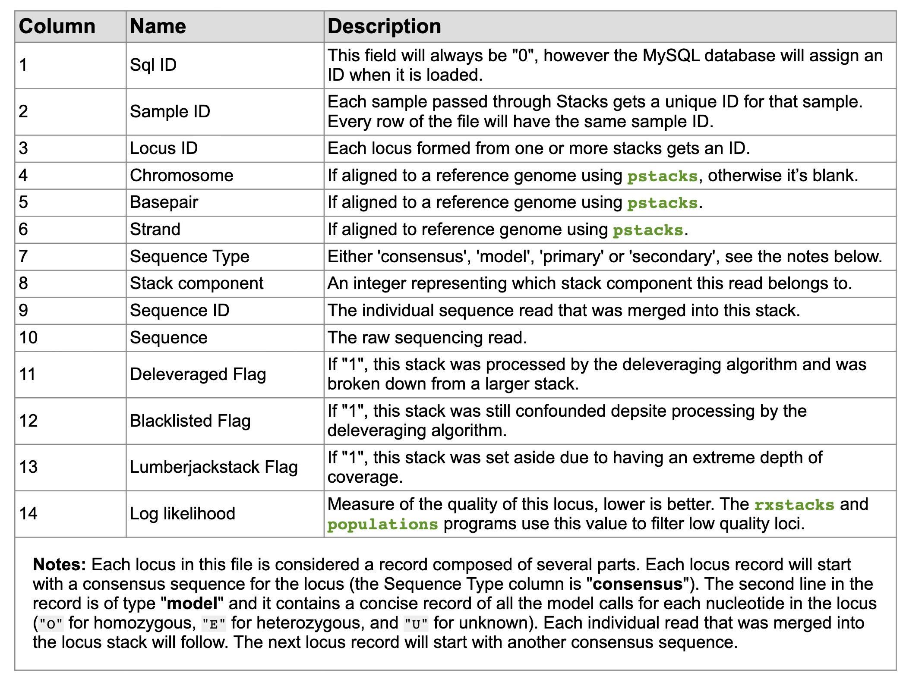

# BIOL*3300 Lab8 F21
## Variant Calling Practice on Compute Canada 
### Background review
In this lab, we will continue the process of characterizing genotypes. This series of labs is based on the published protocol:

[Rochette, N.C. and Catchen, J.M., 2017. Deriving genotypes from RAD-seq short-read data using Stacks. Nature Protocols, 12(12), pp.2640-2659.](https://www.nature.com/articles/nprot.2017.123)

In the last lab, you mapped reads to a fish reference genome. To do this, we have downloaded the reference genome and created the index. The software bwa was used to align reads. The output .bam/.sam file told you where each read aligned and the details of that alignment. 

The purpose of this lab is to identify a sample’s genotype at different positions across the reference genome. We will use the pstacks program from the stacks software suite to do the analysis. The pstacks software collects all the reads that overlap a nucleotide in the reference genome. From these reads, the genotype is determined at a nucleotide site.

### Step7 Pstacks analysis of SNPs and alleles
#### Obtaining reads and alignments

Move into the stacks_ref directory and load a version of the stacks software that supports pstacks.

```console
    cd ~/scratch/Biol3300/SNP_lab/stacks_ref
    module load nixpkgs/16.09 gcc/5.4.0 stacks/1.46
```

Previously, we only mapped some of the samples reads. If you recall, in the raw folder, we had three lanes of reads. Lane 1 contains 10 files of sequences that are all from the same fish population, South Jetty, but we only used one file. To get all the reads that map to a sample, we would need to sorting the barcodes from all the 10 files and align them to the genome.


In order to analyze a sample’s genotype at different positions across the reference genome, we demultiplexed and mapped reads from all 10 fastq files (001-010.fq.gz) of lane 3 in the raw directory. One of fish samples, **cs_1335.01** from the lane 3 folder, will be used in this lab. The process of mapping all reads to this sample and aligning reads to the genome were exactly the same as we previously did on lab 6 and lab 7. To save time, you can copy sample **cs_1335.01.fq.gz** and its **bam file** to your directories:

```console
    cp /scratch/hchang02/Biol3300/SNP_lab/cleaned/cs_1335.01.fq.gz ~/scratch/Biol3300/SNP_lab/cleaned
    cp /scratch/hchang02/Biol3300/SNP_lab/alignments/cs_1335.01.bam ~/scratch/Biol3300/SNP_lab/alignments
```

#### Running pstacks
We will first define some arguments for pstacks.
```console
    sample=cs_1335.01
    sample_index=1
    bam_file=../alignments/$sample.bam
    pstacks -f $bam_file -i $sample_index -o ./  
```
**sample** is our sample name
**sample_index** is the unique identifier for the sample. We only have one sample, but we would set the sample index to '1' for the first sample file, '2' for the second, and so on if had more.

This will give you the following output:
```console
pstacks parameters selected:
  Alignments file: ./cs_1335.01.aligned.sorted.bam
  Output directory: ./
  Sample ID: 1
  Min locus depth: 3
  Max clipped proportion: 0.15
  Min mapping quality: 10
  Model: snp
    Model alpha: 0.05
Reading alignments...
Done reading alignment records:
  Kept 1088586 primary alignments
  Skipped 153728 (12.2%) primary alignments with insufficient mapping qualities
  Skipped 21608 (1.7%) excessively soft-clipped primary alignments
  Skipped 7995 secondary alignments
  Skipped 0 supplementary alignments
  Skipped 38245 unmapped reads
Collapsed reads into 132496 stacks.
Created 42145 loci; mean coverage is 25.83 (stdev: 15.87, max: 1038).
Discarded 2671 low coverage loci comprising 3451 (0.3%) reads.
Kept 39474 loci; mean coverage is 27.49 (stdev: 15.01, max: 1038).
Identifying polymorphic sites and calling consensus sequences...done. (0 loci were blacklisted.)
Writing tags, models, snps, and alleles files...
pstacks is done.
```

From the log files of pstacks, the number of primary alignments (i.e., 1088586) were kept for the analysis. Dividing this number by the initial number of reads (i.e, 1302521 ) of the sample gives the percentage of reads that remain after alignment and filtering. This percentage is one of the main statistics to consider in assessing the effectiveness of an alignment protocol. In our case, the percentage of used reads is 83.57%.

Count the number of reads that are in the file 'cs_1335.01.fq.gz'. There are different ways of doing this. I’d recommend matching the number of lines in the file that start with @ and counting them. The initial number of reads (1302521).

```console
    zless ../cleaned/cs_1335.01.fq.gz | grep '^@' | wc -l 
    zgrep -c '^@' ../cleaned/cs_1335.01.fq.gz
```

**Note:** Percentages of aligned reads under 50% should be a trigger to reconsider the alignment protocol. Such low numbers may be caused, notably, by a misuse of the alignment program, a poor choice of parameters, or a very incomplete and/or distant reference genome.

Still in the log files of pstacks, check the average per-locus coverage. These numbers should provide an estimate of the actual sequencing coverage that was achieved. Per-locus coverage for sample cs_1335.01 was 27.49.

**Note:** Coverage, or the number of reads that map to a reference genome position, strongly affects the quality of genotype calls. If samples have low-coverage, genotypes may be called as "unknown" or be miscalled. 

### Step8 Reading the fields mean in Stacks output files

After its successful completion, pstacks should have created four files for each sample in addition to the screen output (\$sample.tags.tsv.gz, \$sample.models.tsv.gz, \$sample.snps.tsv.gz, and \$sample.alleles.tsv.gz). 

#### 1. sample.tags.tsv: Assembled loci
A 'tag' is another name for a 'read'. This file shows where every tag aligns, e.g. at which locus, and the genotype call. 

<center>

</center>

We can check the file with: 
```console
    zless cs_1335.01.tags.tsv.gz 
```

Several reads/tags such as primary 0, primary 1 etc. aligned to the same genomic location on chromosome/contig "groupIII" from the reference genome at position 10,005,320. The consensus sequence for this sample, based on all reads, at this site is shown.

The predicted genotype of this individual is shown on the line 'model'. The model is "O" for homozygous, "E" for heterozygous, and "U" for unknown. It is hard to see, but position 15 is deemed heterozygous with a 'E' labeled. Investigate this record on your machine by looking at more of the aligned reads. 

A figure of the first locus can help you understand:  
<center>

</center>

#### 2. sample.snps.tsv: Model calls from each locus
This file does not include the reads. It just has the summary of model calls as seen in the tags file. 

<center>

</center>

We see the nucleotide calls for cs_1335.01 in this case at locus 1. We see the heterozygote again. 

```console
    zless cs_1335.01.snps.tsv.gz | head -n 20
```

The output is:
```console
0	1	1	0	O	44.36	T	-		
0	1	1	1	O	44.36	G	-		
0	1	1	2	O	44.36	C	-		
0	1	1	3	O	44.36	A	-		
0	1	1	4	O	44.36	G	-		
0	1	1	5	O	44.36	G	-		
0	1	1	6	O	44.36	A	-		
0	1	1	7	O	44.36	T	-		
0	1	1	8	O	44.36	G	-		
0	1	1	9	O	44.36	C	-		
0	1	1	10	O	44.36	A	-		
0	1	1	11	O	44.36	G	-		
0	1	1	12	O	44.36	A	-		
0	1	1	13	O	44.36	G	-		
0	1	1	14	E	-17.36	C	G		
0	1	1	15	O	44.36	C	-		
0	1	1	16	O	44.36	G	-		
0	1	1	17	O	44.36	G	-		
0	1	1	18	O	44.36	C	-
```
As we found, the SNP site is on the 15th nucleotide (Note here starts with 0).

#### 3. sample.alleles.tsv: Haplotypes/alleles recorded from each locus
This file lists the different haplotypes/alleles recorded from each locus. 

<center>

</center>

```console
    zless cs_1335.01.alleles.tsv.gz | head  
```

The output is:
```console
0	1	1	C	68.75	22
0	1	1	G	31.25	10
0	1	4	CC	42.86	15
0	1	4	GT	57.14	20
0	1	13	C	39.47	15
0	1	13	T	60.53	23
0	1	15	A	72.73	8
0	1	15	G	27.27	3
0	1	20	A	41.18	14
```
At locus 1, there were two alleles at position 15. These are represented here. In the tags file, the first locus has an allele G found on 10 reads compared to C on 22 reads. 

### Assignment for Lab 8
**Please perform the pstacks unit of Stacks on sample cs_1335.02.fq.gz with its bam file. You need to copy cs_1335.02.fq.gz and cs_1335.02.bam from my directories as the example cs_1335.01 in this tutorial.**

**Give the aligned reads percentage and per-locus coverage on sample cs_1335.02.fq.gz.**
**How does this sample compare to sample cs_1335.01?**
**Using the output files, find a heterozygous site within the sample and give its genomic position.**


### Reference
These lab materials are from the following papers and website:
1. [Rochette, N.C. and Catchen, J.M., 2017. Deriving genotypes from RAD-seq short-read data using Stacks. Nature Protocols, 12(12), pp.2640-2659.](https://www.nature.com/articles/nprot.2017.123)
1. [The population structure and recent colonization history of Oregon threespine stickleback determined using restriction-site associated DNA-sequencing. Mol. Ecol. 22, 2864–2883 (2013).](https://pubmed.ncbi.nlm.nih.gov/23718143/)
1. https://catchenlab.life.illinois.edu/stacks/manual-v1/