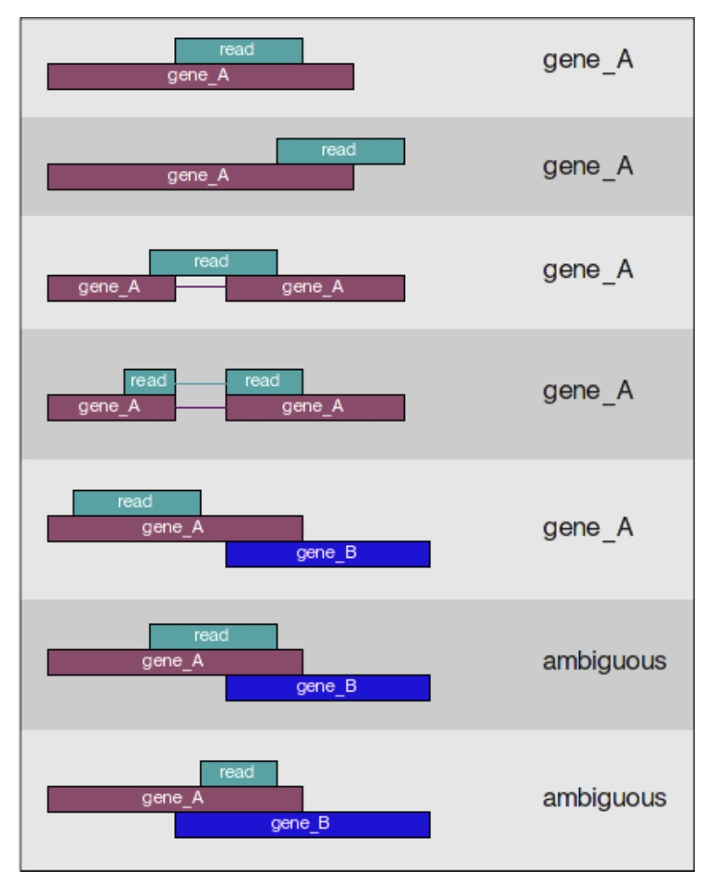

# BIOL*3300 Lab9 F21
## Reference-based RNA-seq data analysis 
### Introduction to RNA-seq data
In recent years, RNA sequencing (in short RNA-Seq) has become a very widely used technology to analyze the continuously changing cellular transcriptome, i.e. the set of all RNA molecules in one cell or a population of cells. One of the most common aims of RNA-Seq is the profiling of gene expression by identifying genes or molecular pathways that are differentially expressed (DE) between two or more biological conditions. 


The dataset we are using for this lab is part of a larger study described in [Kenny PJ et al., Cell Rep 2014](https://www.ncbi.nlm.nih.gov/pubmed/25464849). The authors are investigating interactions between various genes involved in Fragile X syndrome, a disease of aberrant protein production, which results in cognitive impairment and autistic-like features. **The authors sought to show that RNA helicase MOV10 regulates the translation of RNAs involved in Fragile X syndrome.**

From this study we are using the [RNA-seq data](https://www.ncbi.nlm.nih.gov/geo/query/acc.cgi?acc=GSE50499) which is publicly available in the [Sequence Read Archive (SRA)](https://www.ncbi.nlm.nih.gov/sra/?term=SRP029367). For this lab we will be looking at a small subset on chr1 (~300,000 reads/sample) and for each group we have three replicates as described in the figure below.

<center>

</center>

#### Planning and obtaining data
We will start by creating a directory that we can use for the rest of the lab as we did for SNP analysis. We will create the RNAseq_lab directory within your scratch/Biol3300 directory. It will have 4 subdirectories within it. 

I have created this SNP_lab directory and you can copy that to your scratch/Biol3300 folder directly with:
```console
      cp -r /scratch/hchang02/Biol3300/RNAseq_lab/ ~/scratch/Biol3300
```
The structure of RNAseq_lab directory:
```
RNAseq_lab/
        genome/
        genome_index/
        raw_data/
        results/
```
Explore these files:

* Navigate to the genome folder. How many nucleotides are in chr1.fa? What is the position of the first annotated exon on chr1.fa?
* Navigate to the raw_data folder. Give the name of one file that arose from RNA Seq of a control sample and one file that arose from RNASeq of the treatment sample. Use head to examine the beginning of the files. There are four lines associated with each read. What information do these lines hold?

#### Read alignment with STAR
The alignment process consists of choosing an appropriate reference genome to map our reads against, and performing the read alignment using one of several splice-aware alignment tools such as STAR or HISAT2 (HISAT2 is a successor to both HISAT and TopHat2). 

For this lab we will be using [STAR (Spliced Transcripts Alignment to a Reference)](https://github.com/hbctraining/Intro-to-rnaseq-hpc-salmon-flipped/blob/main/lessons/STAR_alignment_strategy.md), an aligner designed to specifically address many of the challenges of RNAseq read mapping.

Aligning reads using STAR is a two-step process:
1. Create a genome index
1. Map reads to the genome

Now let's get started by changing our directory to RNAseq_lab and loading up some of the modules for tools we need for this lab to perform alignment and assess the alignment:
```console
    cd ~/scratch/Biol3300/RNAseq_lab
    module load star samtools
```

##### Creating a genome index

For this lab we are using reads that originate from a small subsection of chromosome 1 (~300,000 reads) and so we are using only chr1, not the whole genome, as the template. STAR requires the template to be indexed before alignment for accuracy and quickness.
 
For this lab, the reference genome is already indexed, as this can take a while. The code used is provided below, **but do not run it.**

For indexing the reference genome, a reference genome (FASTA) is required and an annotation file (GTF or GFF3) is suggested. The latter improves the accuracy of read alignment.

The basic options to generate genome indices using STAR are as follows:

--runThreadN: number of threads
--runMode: genomeGenerate mode
--genomeDir: /path/to/store/genome_indices
--genomeFastaFiles: /path/to/FASTA_file (reference genome)
--sjdbGTFfile: /path/to/GTF_file (gene annotation)
--sjdbOverhang: readlength -1

And the command to run indexing is: 
```console
** DO NOT RUN **
    STAR --runThreadN 6 \
    --runMode genomeGenerate \
    --genomeDir ./genome_index/ \
    --sjdbGTFfile ./genome/chr1-hg19_genes.gtf \
    --genomeFastaFiles ./genome/chr1.fa \
    --sjdbOverhang 99
```
This code makes an index of the genome and deposits it into the genome_index directory.

##### Mapping reads
The basic options for mapping reads to the genome using STAR are as follows:

--runThreadN: number of threads
--readFilesIn: /path/to/FASTQ_file
--genomeDir: /path/to/genome_indices
--outFileNamePrefix: prefix for all output files

We will also be using some advanced options:

--outSAMtype: output filetype (SAM default)
--outSAMUnmapped: what to do with unmapped reads
--outSAMattributes: SAM attributes

More details on STAR and its functionality can be found in the [user manual](https://github.com/alexdobin/STAR/blob/master/doc/STARmanual.pdf).

The full STAR alignment command you should use is provided below. We will align the first replicate in the Mov10 overexpression group, Mov10_oe_1_subset.fq.

Make sure you are in the RNAseq_lab directory and then run the command below:
```console
    STAR --runThreadN 6 \
    --genomeDir genome_index/ \
    --readFilesIn raw_data/Mov10_oe_1.subset.fq \
    --outFileNamePrefix results/Mov10_oe_1_ \
    --outSAMtype BAM SortedByCoordinate \
    --outSAMunmapped Within \
    --outSAMattributes Standard
```
This will give you outputs like the following:
```console
        STAR --runThreadN 6 --genomeDir genome_index/ --readFilesIn raw_data/Mov10_oe_1.subset.fq --outFileNamePrefix results/Mov10_oe_1_ --outSAMtype BAM SortedByCoordinate --outSAMunmapped Within --outSAMattributes NH HI NM MD AS
        STAR version: 2.7.9a   compiled: 2021-07-08T15:06:22+00:00 build-node.computecanada.ca:/tmp/ebuser/avx2/STAR/2.7.9a/GCCcore-9.3.0/STAR-2.7.9a/source
Nov 15 19:13:02 ..... started STAR run
Nov 15 19:13:02 ..... loading genome
Nov 15 19:13:14 ..... started mapping
Nov 15 19:13:41 ..... finished mapping
Nov 15 19:13:41 ..... started sorting BAM
Nov 15 19:13:54 ..... finished successfully
```
The key file in the results is the "Mov10_oe_1_Aligned.sortedByCoord.out.bam" file. We requested a .BAM file, the compacted form of a .SAM file from STAR. To take a look at our alignment results without writing them to a new file, we first convert our .BAM file into .SAM format using samtools and then pipe it to the less command. 

```console
    samtools view -h results/Mov10_oe_1_Aligned.sortedByCoord.out.bam | head 
```

Look at the contents of the alignment output:
There is a read "HWI-ST330:304:H045HADXX:2:1212:14589:87907" that aligns to position 18046 for 16 nucleotides, has a gap of 6,676 nucleotides, and then aligns to 84 nucleotides. Its CIGAR code is "16M6676N84M". 

We can also check some simple stats for alignment file:
```console
    samtools flagstats results/Mov10_oe_1_Aligned.sortedByCoord.out.bam  
```
This will give you the following output and you can see 92.43% sequences mapped to the reference genome.
```console
314463 + 0 in total (QC-passed reads + QC-failed reads)
8563 + 0 secondary
0 + 0 supplementary
0 + 0 duplicates
290665 + 0 mapped (92.43% : N/A)
0 + 0 paired in sequencing
0 + 0 read1
0 + 0 read2
0 + 0 properly paired (N/A : N/A)
0 + 0 with itself and mate mapped
0 + 0 singletons (N/A : N/A)
0 + 0 with mate mapped to a different chr
0 + 0 with mate mapped to a different chr (mapQ>=5)
```
#### Assigning reads to features
Once we have our reads aligned to the genome, the next step is to count how many reads have been mapped to each gene. The input files required for counting include the BAM file and an associated gene annotation file in GTF format. We will use **featureCounts** program from subread software to get the gene counts. We picked this tool because it is accurate, fast and is relatively easy to use.

featureCounts works by taking the alignment coordinates for each read and cross-referencing that to the coordinates for features described in the GTF. Most commonly a feature is considered to be a gene, which is the union of all exons (which is also a feature type) that make up that gene. This tool is best used for counting reads associated with genes, and not for splice isoforms or transcripts.

featureCounts only includes and counts those reads that map to a single location (uniquely mapping) and follows the scheme in the figure below for assigning reads to a gene/exon.

<center>

</center>

To use the featureCounts, we need to load the subread software:
```console
    module load subread
```
```console
    featureCounts -s 2 \
    -a ./genome/chr1-hg19_genes.gtf \
    -o ./results/Mov10_featurecounts.txt \
    ./results/Mov10_oe_1_Aligned.sortedByCoord.out.bam
```
**-s** tells the program to perform strand-specific read counting, 0 (unstranded), 1 (stranded) and 2 (reversely stranded).
**-a** provides a path to the annotation file. 
**-o** specifies where to write the output file.


This will give you the following output:

```console
//================================= Running ==================================\\
||                                                                            ||
|| Load annotation file chr1-hg19_genes.gtf ...                               ||
||    Features : 37213                                                        ||
||    Meta-features : 2330                                                    ||
||    Chromosomes/contigs : 1                                                 ||
||                                                                            ||
|| Process BAM file Mov10_oe_1_Aligned.sortedByCoord.out.bam...               ||
||    Strand specific : reversely stranded                                    ||
||    Single-end reads are included.                                          ||
||    Total alignments : 314463                                               ||
||    Successfully assigned alignments : 224925 (71.5%)                       ||
||    Running time : 0.01 minutes                                             ||
||                                                                            ||
|| Write the final count table.                                               ||
|| Write the read assignment summary.                                         ||
||                                                                            ||
|| Summary of counting results can be found in file "./results/Mov10_feature  ||
|| counts.txt.summary"                                                        ||
||                                                                            ||
\\============================================================================//
```

A "meta-feature" is a feature composed of subfeatures, e.g. a gene composed of exons. Above you noted the number of reads that aligned to chromosome 1 is 71.5%. 

The output of this tool is 2 files, a count matrix and a summary file that tabulates how many the reads were "assigned" or counted and the reason they remained "unassigned". Let's take a look at the summary file:

```console
    less results/Mov10_featurecounts.txt.summary
```
Now let's look at the count matrix:
```console
    less results/Mov10_featurecounts.txt
```
Since the featureCounts output has additional columns with information about genomic coordinates, gene length etc., we can use the cut command to select only those columns that you are interested in. Column 1 has the "meta-feature/gene" name. Column 7 has the counts.
```console
    cut -f1,7 results/Mov10_featurecounts.txt > results/Mov10_featurecounts.sub.txt
    less results/Mov10_featurecounts.sub.txt 
```
What value of counts does the most highly expressed gene have? 
```console
    sort -k2 -nr results/Mov10_featurecounts.sub.txt | head
```

### Assignment for Lab 9
**Follow the tutorial to perform the RNA-seq analysis with Irrel_kd_1.subset.fq. Upload your screen short of featureCounts output (output showed in page 7) of this sample with your username in terminal.** 

### Reference
These lab materials are from the following website:
1. http://www.ncbi.nlm.nih.gov/pubmed/25464849
1. https://github.com/hbctraining/Intro-to-rnaseq-hpc-salmon-flipped/tree/main/lessons
1. https://github.com/alexdobin/STAR/blob/master/doc/STARmanual.pdf