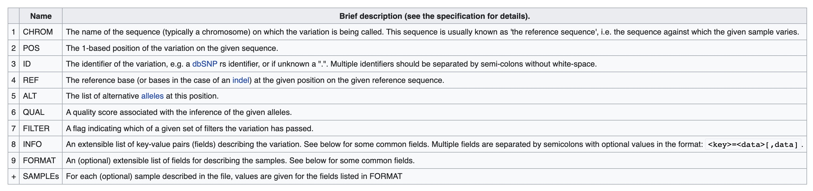

# BIOL*3300 Lab9 F21
## Variant Calling Practice on Compute Canada 
### Background review
In this lab, we will continue the process of analyzing variant calling. This series of labs is based on the published protocol:

[Rochette, N.C. and Catchen, J.M., 2017. Deriving genotypes from RAD-seq short-read data using Stacks. Nature Protocols, 12(12), pp.2640-2659.](https://www.nature.com/articles/nprot.2017.123)

In the last lab, you used the pstacks program from the stacks software suite to identify single sample’s genotype at different positions across the reference genome. The pstacks software collects all the reads that overlap a nucleotide in the reference genome. From these reads, the genotype is determined at a nucleotide site.

The purpose of this lab is to identifying genetic sites that vary across several samples. We will use [bcftools](https://samtools.github.io/bcftools/bcftools.html) to manipulate variant calls in the Variant Call Format (VCF) and its binary counterpart BCF.  

#### Variant calling
A variant call is a conclusion that there is a nucleotide difference vs. some reference at a given position in an individual genome or transcriptome, often referred to as a Single Nucleotide Polymorphism (SNP). The call is usually accompanied by an estimate of variant frequency and some measure of confidence. Variant calling can help establish potential mutations or differences that are attributable to differences in traits or characteristics in a given population. 

#### Creating directory 
Move into the SNP_lab directory and create a sub-directory variant_calling for today's lab.

```console
    cd ~/scratch/Biol3300/SNP_lab
    mkdir variant_calling
    cd variant_calling
```

In order to compare variants across different samples, two fish samples, **sj_1819.41** and **wc_1222.02**, from oceanic and freshwater, are picked and will be used in this lab. The process of mapping all reads to this sample and aligning reads to the genome were exactly the same as we previously did on lab 6 and lab 7. To save time, you can copy bam files of sample **sj_1819.41.bam** and **wc_1222.02.bam** to your alignment directory:

```console
    cp /scratch/hchang02/Biol3300/SNP_lab/alignments/sj_1819.41.bam ~/scratch/Biol3300/SNP_lab/alignments
    cp /scratch/hchang02/Biol3300/SNP_lab/alignments/wc_1222.02.bam ~/scratch/Biol3300/SNP_lab/alignments
```
#### Sorting BAM file by coordinates 
Generated BAM files from bwa alignment tool are unsorted. In order to compare variants, BAM files need to be sorted before we perform the downstream analysis. BAM files can be sorted in multiple ways, e.g. by location of alignment on the chromosome, by read name, etc. 

We sort the BAM file using the sort command from samtools that sort reads from the beginning of the first chromosome to the last.

```console
    module load samtools
    samtools sort -o ./sj_1819.41.sorted.bam ../alignments/sj_1819.41.bam
    samtools sort -o ./wc_1222.02.sorted.bam ../alignments/wc_1222.02.bam
```
**-o** tells the command where to write the output.

You can use samtools to learn more about these sorted bam files. You can get total number of raw reads: 
```console
    samtools stats sj_1819.41.sorted.bam | grep "raw total sequences:"
    samtools stats wc_1222.02.sorted.bam | grep "raw total sequences:"
```
You can also get the number of reads mapped to the reference genome with: 
```console
    samtools stats sj_1819.41.sorted.bam | grep "reads mapped:"
    samtools stats wc_1222.02.sorted.bam | grep "reads mapped:"
```
#### Calculating the read coverage of positions in the genome
Do the first pass on variant calling by counting read coverage with bcftools. We will use the command mpileup to call the variants. mpileup enables the parallel comparison of the individuals in the sample and the reference genome. 

```console
    module load bcftools
    ref=../genome/Gasterosteus_aculeatus.BROADS1.dna.toplevel.fa
    bcftools mpileup -f $ref sj_1819.41.sorted.bam wc_1222.02.sorted.bam -o ./2inds_sj_wc.bcf
```
**-f** flags the path to the reference genome
**-o** specifies where to write the output file

#### Detecting the single nucleotide polymorphisms (SNPs)
Identify SNPs using bcftools call command:

```console
    bcftools call -m -v 2inds_sj_wc.bcf -o ./2inds_sj_wc.vcf
```
**-m** allows for multiallelic and rare-variant calling 
**-v** tells the program to output variant sites only (not every site in the genome)
**-o** specifies where to write the output file

#### Exploring the VCF format:
Let's check the created vcf file:

```console
    less 2inds_sj_wc.vcf 
```
You will see the header (which describes the format), the time and date the file was created, the version of bcftools that was used, the command line parameters used, and some additional information:

```console
##fileformat=VCFv4.2
##FILTER=<ID=PASS,Description="All filters passed">
##bcftoolsVersion=1.11+htslib-1.11
##bcftoolsCommand=mpileup -f ../genome/Gasterosteus_aculeatus.BROADS1.dna.toplevel.fa -o ./2inds_sj_wc.bcf sj_1819.41.sorted.bam wc_1222.02.sorted.bam
##reference=file://../genome/Gasterosteus_aculeatus.BROADS1.dna.toplevel.fa
##contig=<ID=groupI,length=28185914>
##contig=<ID=groupII,length=23295652>
... 
##contig=<ID=scaffold_1934,length=60>
##ALT=<ID=*,Description="Represents allele(s) other than observed.">
##INFO=<ID=INDEL,Number=0,Type=Flag,Description="Indicates that the variant is an INDEL.">
##INFO=<ID=IDV,Number=1,Type=Integer,Description="Maximum number of raw reads supporting an indel">
##INFO=<ID=IMF,Number=1,Type=Float,Description="Maximum fraction of raw reads supporting an indel">
##INFO=<ID=DP,Number=1,Type=Integer,Description="Raw read depth">
##INFO=<ID=VDB,Number=1,Type=Float,Description="Variant Distance Bias for filtering splice-site artefacts in RNA-seq data (bigger is better)",Version="3">
##INFO=<ID=RPB,Number=1,Type=Float,Description="Mann-Whitney U test of Read Position Bias (bigger is better)">
##INFO=<ID=MQB,Number=1,Type=Float,Description="Mann-Whitney U test of Mapping Quality Bias (bigger is better)">
##INFO=<ID=BQB,Number=1,Type=Float,Description="Mann-Whitney U test of Base Quality Bias (bigger is better)">
##INFO=<ID=MQSB,Number=1,Type=Float,Description="Mann-Whitney U test of Mapping Quality vs Strand Bias (bigger is better)">
##INFO=<ID=SGB,Number=1,Type=Float,Description="Segregation based metric.">
##INFO=<ID=MQ0F,Number=1,Type=Float,Description="Fraction of MQ0 reads (smaller is better)">
##FORMAT=<ID=PL,Number=G,Type=Integer,Description="List of Phred-scaled genotype likelihoods">
##FORMAT=<ID=GT,Number=1,Type=String,Description="Genotype">
##INFO=<ID=ICB,Number=1,Type=Float,Description="Inbreeding Coefficient Binomial test (bigger is better)">
##INFO=<ID=HOB,Number=1,Type=Float,Description="Bias in the number of HOMs number (smaller is better)">
##INFO=<ID=AC,Number=A,Type=Integer,Description="Allele count in genotypes for each ALT allele, in the same order as listed">
##INFO=<ID=AN,Number=1,Type=Integer,Description="Total number of alleles in called genotypes">
##INFO=<ID=DP4,Number=4,Type=Integer,Description="Number of high-quality ref-forward , ref-reverse, alt-forward and alt-reverse bases">
##INFO=<ID=MQ,Number=1,Type=Integer,Description="Average mapping quality">
##bcftools_callVersion=1.11+htslib-1.11
##bcftools_callCommand=call -m -v -o ./2inds_sj_wc.vcf 2inds_sj_wc.bcf; Date=Sun Nov 14 16:46:42 2021
```
To further check the information on each of the variations observed:
```console
    grep -v "##" 2inds_sj_wc.vcf | head
```

This will give you the following output:

```console
#CHROM  POS     ID      REF     ALT     QUAL    FILTER  INFO    FORMAT  sj_1819.41.sorted.bam   wc_1222.02.sorted.bam
groupI  11833   .       C       G       411     .       DP=46;VDB=7.12062e-27;SGB=-1.28176;MQ0F=0;AC=4;AN=4;DP4=0,0,46,0;MQ=60  GT:PL   1/1:213,45,0    1/1:225,93,0
groupI  46936   .       A       G       9.55725 .       DP=1;SGB=-0.157211;MQ0F=0;AC=2;AN=2;DP4=0,0,0,1;MQ=60   GT:PL   ./.:0,0,0       1/1:36,3,0
groupI  47002   .       T       C       12.31   .       DP=1;SGB=-0.157211;MQ0F=0;AC=2;AN=2;DP4=0,0,0,1;MQ=60   GT:PL   ./.:0,0,0       1/1:39,3,0
groupI  49679   .       G       A       100     .       DP=29;VDB=1.33331e-05;SGB=4.00342;RPB=1;MQB=1;BQB=0.163537;MQ0F=0;ICB=0.3;HOB=0.125;AC=1;AN=4;DP4=0,21,0,8;MQ=60        GT:PL   0/0:0,39,195    0/1:134,0,142
groupI  49790   .       T       C       233     .       DP=54;VDB=1.30483e-15;SGB=-9.32613;RPB=1;MQB=1;BQB=0.725709;MQ0F=0;ICB=0.5;HOB=0.5;AC=2;AN=4;DP4=30,0,24,0;MQ=60        GT:PL   0/1:141,0,140   0/1:125,0,150
groupI  65518   .       AAAACCCAAAC     AAAAC   170     .       INDEL;IDV=6;IMF=0.4;DP=20;VDB=2.63505e-13;SGB=2.63044;MQ0F=0;ICB=0.3;HOB=0.125;AC=1;AN=4;DP4=14,0,6,0;MQ=60     GT:PL   0/0:0,15,212    0/1:204,0,162
groupI  65523   .       CCAAACA CCA     218     .       INDEL;IDV=9;IMF=0.6;DP=20;VDB=1.07502e-11;SGB=4.69269;MQ0F=0;ICB=0.5;HOB=0.5;AC=2;AN=4;DP4=11,0,9,0;MQ=60       GT:PL   0/0:0,15,212    1/1:255,7,0
groupI  65560   .       A       G       83      .       DP=20;VDB=0.00187095;SGB=1.94933;RPB=0.00471436;MQB=1;BQB=0.0688904;MQ0F=0;ICB=0.5;HOB=0.5;AC=2;AN=4;DP4=15,0,5,0;MQ=60 GT:PL   1/1:122,15,0    0/0:0,45,188
groupI  65565   .       A       G       276     .       DP=20;VDB=9.30559e-10;SGB=-0.906886;MQ0F=0;AC=4;AN=4;DP4=0,0,19,0;MQ=60 GT:PL   1/1:122,15,0    1/1:181,42,0
```

The body of VCF follows the header, and is tab separated into 8 mandatory columns and an unlimited number of optional columns that may be used to record other information about the sample(s). The first few columns represent the information we have about a predicted variation.

<center>

</center>


The last columns contains the genotypes and can be a bit more tricky to decode. In brief, we have:

**GT:** The genotype of this sample which for a diploid genome is encoded with a 0 for the REF allele, 1 for the first ALT allele, 2 for the second and so on. So 0/0 means homozygous reference, 0/1 is heterozygous, and 1/1 is homozygous for the alternate allele. For a diploid organism, the GT field indicates the two alleles carried by the sample, encoded by a 0 for the REF allele, 1 for the first ALT allele, 2 for the second ALT allele, etc.
**DP:** reflects the total depth of coverage over all samples.
**PL:** the likelihoods of the given genotypes.

To learn more about the VCF file, you can click this [VCF guide](https://gatk.broadinstitute.org/hc/en-us/articles/360035531692-VCF-Variant-Call-Format).


#### Assessing the VCF file
We can subset the output of bcftools stats using a pipe (|) and grep to get the information you want. 
You can get the number of SNPs:
```console
    bcftools stats 2inds_sj_wc.vcf | grep "number of SNPs:"
```
You can also get the number of indels: 
```console
    bcftools stats 2inds_sj_wc.vcf | grep "number of indels:"
```

### Assignment for Lab 9
**Please follow the tutorial to perform the variant calling analysis between cs_1335.12.bam and pcr_1211.04.bam files.**

**You need to copy the bam files from my alignments directory as this tutorial showed.**
**You need to provide the number of SNPs and indels based on the vcf file your created.**


### Reference
These lab materials are from the following papers and website:
1. [Rochette, N.C. and Catchen, J.M., 2017. Deriving genotypes from RAD-seq short-read data using Stacks. Nature Protocols, 12(12), pp.2640-2659.](https://www.nature.com/articles/nprot.2017.123)
1. [The population structure and recent colonization history of Oregon threespine stickleback determined using restriction-site associated DNA-sequencing. Mol. Ecol. 22, 2864–2883 (2013).](https://pubmed.ncbi.nlm.nih.gov/23718143/)
1. https://datacarpentry.org/wrangling-genomics/04-variant_calling/index.html